hw01-alexander-lopez.Rmd
================
Alexander Lopez
2/13/2018

2) Importing Automoblie Data Set
================================

``` r
url <-"https://archive.ics.uci.edu/ml/machine-learning-databases/autos/imports-85.data"
download.file(url = url, destfile = 'imports-85.data')
url
```

    ## [1] "https://archive.ics.uci.edu/ml/machine-learning-databases/autos/imports-85.data"

``` r
##charater vector for the names of columns 
library(reader)
```

    ## Loading required package: NCmisc

``` r
#numeric varaibles in importing data
col_names_85 <- c(
  "symboling", 
  "normalized_losses",
  "make",            
  "fuel_type",        
  "aspirations",     
  "num_of_doors",    
  "body_style",       
  "drive_wheels",     
 "engine_location", 
 "wheel_base" ,       
 "length",           
 "width",            
"height",           
"curb_weight",    
"engine_type",     
"num_of_cylinders" ,
"engine_size",   
"fuel_system" ,    
"bore",            
"stroke",           
 "compression_ratio", 
 "horsepower",       
 "peak_rpm",
 "city_mpg",         
"highway_mpg",    
"price"    )
col_types_85 <- c(
  "integer" , 
  "character"  ,  
  "character",
  "character",
  "character",
  "character", 
  "character", 
  "character" ,
  "character" ,  
  "double" ,   
  "double"  , 
  "double" ,
  "double",  
  "double", 
  "character" ,
  "character",
  "integer", 
  "character",
  "double"  , 
  "double", 
  "double" ,
  "integer" , 
  "integer"  , 
  "integer"  , 
  "integer")
col_types_85
```

    ##  [1] "integer"   "character" "character" "character" "character"
    ##  [6] "character" "character" "character" "character" "double"   
    ## [11] "double"    "double"    "double"    "double"    "character"
    ## [16] "character" "integer"   "character" "double"    "double"   
    ## [21] "double"    "integer"   "integer"   "integer"   "integer"

``` r
dat_85 <- read.csv(
  file = url, 
  col.names = col_names_85, 
  sep = ",", 
  colClasses = col_types_85,
  na.strings = ("?")
  
                   )

dat_85
```

    ##     symboling normalized_losses          make fuel_type aspirations
    ## 1           3              <NA>   alfa-romero       gas         std
    ## 2           1              <NA>   alfa-romero       gas         std
    ## 3           2               164          audi       gas         std
    ## 4           2               164          audi       gas         std
    ## 5           2              <NA>          audi       gas         std
    ## 6           1               158          audi       gas         std
    ## 7           1              <NA>          audi       gas         std
    ## 8           1               158          audi       gas       turbo
    ## 9           0              <NA>          audi       gas       turbo
    ## 10          2               192           bmw       gas         std
    ## 11          0               192           bmw       gas         std
    ## 12          0               188           bmw       gas         std
    ## 13          0               188           bmw       gas         std
    ## 14          1              <NA>           bmw       gas         std
    ## 15          0              <NA>           bmw       gas         std
    ## 16          0              <NA>           bmw       gas         std
    ## 17          0              <NA>           bmw       gas         std
    ## 18          2               121     chevrolet       gas         std
    ## 19          1                98     chevrolet       gas         std
    ## 20          0                81     chevrolet       gas         std
    ## 21          1               118         dodge       gas         std
    ## 22          1               118         dodge       gas         std
    ## 23          1               118         dodge       gas       turbo
    ## 24          1               148         dodge       gas         std
    ## 25          1               148         dodge       gas         std
    ## 26          1               148         dodge       gas         std
    ## 27          1               148         dodge       gas       turbo
    ## 28         -1               110         dodge       gas         std
    ## 29          3               145         dodge       gas       turbo
    ## 30          2               137         honda       gas         std
    ## 31          2               137         honda       gas         std
    ## 32          1               101         honda       gas         std
    ## 33          1               101         honda       gas         std
    ## 34          1               101         honda       gas         std
    ## 35          0               110         honda       gas         std
    ## 36          0                78         honda       gas         std
    ## 37          0               106         honda       gas         std
    ## 38          0               106         honda       gas         std
    ## 39          0                85         honda       gas         std
    ## 40          0                85         honda       gas         std
    ## 41          0                85         honda       gas         std
    ## 42          1               107         honda       gas         std
    ## 43          0              <NA>         isuzu       gas         std
    ## 44          1              <NA>         isuzu       gas         std
    ## 45          0              <NA>         isuzu       gas         std
    ## 46          2              <NA>         isuzu       gas         std
    ## 47          0               145        jaguar       gas         std
    ## 48          0              <NA>        jaguar       gas         std
    ## 49          0              <NA>        jaguar       gas         std
    ## 50          1               104         mazda       gas         std
    ## 51          1               104         mazda       gas         std
    ## 52          1               104         mazda       gas         std
    ## 53          1               113         mazda       gas         std
    ## 54          1               113         mazda       gas         std
    ## 55          3               150         mazda       gas         std
    ## 56          3               150         mazda       gas         std
    ## 57          3               150         mazda       gas         std
    ## 58          3               150         mazda       gas         std
    ## 59          1               129         mazda       gas         std
    ## 60          0               115         mazda       gas         std
    ## 61          1               129         mazda       gas         std
    ## 62          0               115         mazda       gas         std
    ## 63          0              <NA>         mazda    diesel         std
    ## 64          0               115         mazda       gas         std
    ## 65          0               118         mazda       gas         std
    ## 66          0              <NA>         mazda    diesel         std
    ## 67         -1                93 mercedes-benz    diesel       turbo
    ## 68         -1                93 mercedes-benz    diesel       turbo
    ## 69          0                93 mercedes-benz    diesel       turbo
    ## 70         -1                93 mercedes-benz    diesel       turbo
    ## 71         -1              <NA> mercedes-benz       gas         std
    ## 72          3               142 mercedes-benz       gas         std
    ## 73          0              <NA> mercedes-benz       gas         std
    ## 74          1              <NA> mercedes-benz       gas         std
    ## 75          1              <NA>       mercury       gas       turbo
    ## 76          2               161    mitsubishi       gas         std
    ## 77          2               161    mitsubishi       gas         std
    ## 78          2               161    mitsubishi       gas         std
    ## 79          1               161    mitsubishi       gas       turbo
    ## 80          3               153    mitsubishi       gas       turbo
    ## 81          3               153    mitsubishi       gas         std
    ## 82          3              <NA>    mitsubishi       gas       turbo
    ## 83          3              <NA>    mitsubishi       gas       turbo
    ## 84          3              <NA>    mitsubishi       gas       turbo
    ## 85          1               125    mitsubishi       gas         std
    ## 86          1               125    mitsubishi       gas         std
    ## 87          1               125    mitsubishi       gas       turbo
    ## 88         -1               137    mitsubishi       gas         std
    ## 89          1               128        nissan       gas         std
    ## 90          1               128        nissan    diesel         std
    ## 91          1               128        nissan       gas         std
    ## 92          1               122        nissan       gas         std
    ## 93          1               103        nissan       gas         std
    ## 94          1               128        nissan       gas         std
    ## 95          1               128        nissan       gas         std
    ## 96          1               122        nissan       gas         std
    ## 97          1               103        nissan       gas         std
    ## 98          2               168        nissan       gas         std
    ## 99          0               106        nissan       gas         std
    ## 100         0               106        nissan       gas         std
    ## 101         0               128        nissan       gas         std
    ## 102         0               108        nissan       gas         std
    ## 103         0               108        nissan       gas         std
    ## 104         3               194        nissan       gas         std
    ## 105         3               194        nissan       gas       turbo
    ## 106         1               231        nissan       gas         std
    ## 107         0               161        peugot       gas         std
    ## 108         0               161        peugot    diesel       turbo
    ## 109         0              <NA>        peugot       gas         std
    ## 110         0              <NA>        peugot    diesel       turbo
    ## 111         0               161        peugot       gas         std
    ## 112         0               161        peugot    diesel       turbo
    ## 113         0              <NA>        peugot       gas         std
    ## 114         0              <NA>        peugot    diesel       turbo
    ## 115         0               161        peugot       gas         std
    ## 116         0               161        peugot    diesel       turbo
    ## 117         0               161        peugot       gas       turbo
    ## 118         1               119      plymouth       gas         std
    ## 119         1               119      plymouth       gas       turbo
    ## 120         1               154      plymouth       gas         std
    ## 121         1               154      plymouth       gas         std
    ## 122         1               154      plymouth       gas         std
    ## 123        -1                74      plymouth       gas         std
    ## 124         3              <NA>      plymouth       gas       turbo
    ## 125         3               186       porsche       gas         std
    ## 126         3              <NA>       porsche       gas         std
    ## 127         3              <NA>       porsche       gas         std
    ## 128         3              <NA>       porsche       gas         std
    ## 129         1              <NA>       porsche       gas         std
    ## 130         0              <NA>       renault       gas         std
    ## 131         2              <NA>       renault       gas         std
    ## 132         3               150          saab       gas         std
    ## 133         2               104          saab       gas         std
    ## 134         3               150          saab       gas         std
    ## 135         2               104          saab       gas         std
    ## 136         3               150          saab       gas       turbo
    ## 137         2               104          saab       gas       turbo
    ## 138         2                83        subaru       gas         std
    ## 139         2                83        subaru       gas         std
    ## 140         2                83        subaru       gas         std
    ## 141         0               102        subaru       gas         std
    ## 142         0               102        subaru       gas         std
    ## 143         0               102        subaru       gas         std
    ## 144         0               102        subaru       gas         std
    ## 145         0               102        subaru       gas       turbo
    ## 146         0                89        subaru       gas         std
    ## 147         0                89        subaru       gas         std
    ## 148         0                85        subaru       gas         std
    ## 149         0                85        subaru       gas       turbo
    ## 150         1                87        toyota       gas         std
    ## 151         1                87        toyota       gas         std
    ## 152         1                74        toyota       gas         std
    ## 153         0                77        toyota       gas         std
    ## 154         0                81        toyota       gas         std
    ## 155         0                91        toyota       gas         std
    ## 156         0                91        toyota       gas         std
    ## 157         0                91        toyota       gas         std
    ## 158         0                91        toyota    diesel         std
    ## 159         0                91        toyota    diesel         std
    ## 160         0                91        toyota       gas         std
    ## 161         0                91        toyota       gas         std
    ## 162         0                91        toyota       gas         std
    ## 163         1               168        toyota       gas         std
    ## 164         1               168        toyota       gas         std
    ## 165         1               168        toyota       gas         std
    ## 166         1               168        toyota       gas         std
    ## 167         2               134        toyota       gas         std
    ## 168         2               134        toyota       gas         std
    ## 169         2               134        toyota       gas         std
    ## 170         2               134        toyota       gas         std
    ## 171         2               134        toyota       gas         std
    ## 172         2               134        toyota       gas         std
    ## 173        -1                65        toyota       gas         std
    ## 174        -1                65        toyota    diesel       turbo
    ## 175        -1                65        toyota       gas         std
    ## 176        -1                65        toyota       gas         std
    ## 177        -1                65        toyota       gas         std
    ## 178         3               197        toyota       gas         std
    ## 179         3               197        toyota       gas         std
    ## 180        -1                90        toyota       gas         std
    ## 181        -1              <NA>        toyota       gas         std
    ## 182         2               122    volkswagen    diesel         std
    ## 183         2               122    volkswagen       gas         std
    ## 184         2                94    volkswagen    diesel         std
    ## 185         2                94    volkswagen       gas         std
    ## 186         2                94    volkswagen       gas         std
    ## 187         2                94    volkswagen    diesel       turbo
    ## 188         2                94    volkswagen       gas         std
    ## 189         3              <NA>    volkswagen       gas         std
    ## 190         3               256    volkswagen       gas         std
    ## 191         0              <NA>    volkswagen       gas         std
    ## 192         0              <NA>    volkswagen    diesel       turbo
    ## 193         0              <NA>    volkswagen       gas         std
    ## 194        -2               103         volvo       gas         std
    ## 195        -1                74         volvo       gas         std
    ## 196        -2               103         volvo       gas         std
    ## 197        -1                74         volvo       gas         std
    ## 198        -2               103         volvo       gas       turbo
    ## 199        -1                74         volvo       gas       turbo
    ## 200        -1                95         volvo       gas         std
    ## 201        -1                95         volvo       gas       turbo
    ## 202        -1                95         volvo       gas         std
    ## 203        -1                95         volvo    diesel       turbo
    ## 204        -1                95         volvo       gas       turbo
    ##     num_of_doors  body_style drive_wheels engine_location wheel_base
    ## 1            two convertible          rwd           front       88.6
    ## 2            two   hatchback          rwd           front       94.5
    ## 3           four       sedan          fwd           front       99.8
    ## 4           four       sedan          4wd           front       99.4
    ## 5            two       sedan          fwd           front       99.8
    ## 6           four       sedan          fwd           front      105.8
    ## 7           four       wagon          fwd           front      105.8
    ## 8           four       sedan          fwd           front      105.8
    ## 9            two   hatchback          4wd           front       99.5
    ## 10           two       sedan          rwd           front      101.2
    ## 11          four       sedan          rwd           front      101.2
    ## 12           two       sedan          rwd           front      101.2
    ## 13          four       sedan          rwd           front      101.2
    ## 14          four       sedan          rwd           front      103.5
    ## 15          four       sedan          rwd           front      103.5
    ## 16           two       sedan          rwd           front      103.5
    ## 17          four       sedan          rwd           front      110.0
    ## 18           two   hatchback          fwd           front       88.4
    ## 19           two   hatchback          fwd           front       94.5
    ## 20          four       sedan          fwd           front       94.5
    ## 21           two   hatchback          fwd           front       93.7
    ## 22           two   hatchback          fwd           front       93.7
    ## 23           two   hatchback          fwd           front       93.7
    ## 24          four   hatchback          fwd           front       93.7
    ## 25          four       sedan          fwd           front       93.7
    ## 26          four       sedan          fwd           front       93.7
    ## 27          <NA>       sedan          fwd           front       93.7
    ## 28          four       wagon          fwd           front      103.3
    ## 29           two   hatchback          fwd           front       95.9
    ## 30           two   hatchback          fwd           front       86.6
    ## 31           two   hatchback          fwd           front       86.6
    ## 32           two   hatchback          fwd           front       93.7
    ## 33           two   hatchback          fwd           front       93.7
    ## 34           two   hatchback          fwd           front       93.7
    ## 35          four       sedan          fwd           front       96.5
    ## 36          four       wagon          fwd           front       96.5
    ## 37           two   hatchback          fwd           front       96.5
    ## 38           two   hatchback          fwd           front       96.5
    ## 39          four       sedan          fwd           front       96.5
    ## 40          four       sedan          fwd           front       96.5
    ## 41          four       sedan          fwd           front       96.5
    ## 42           two       sedan          fwd           front       96.5
    ## 43          four       sedan          rwd           front       94.3
    ## 44           two       sedan          fwd           front       94.5
    ## 45          four       sedan          fwd           front       94.5
    ## 46           two   hatchback          rwd           front       96.0
    ## 47          four       sedan          rwd           front      113.0
    ## 48          four       sedan          rwd           front      113.0
    ## 49           two       sedan          rwd           front      102.0
    ## 50           two   hatchback          fwd           front       93.1
    ## 51           two   hatchback          fwd           front       93.1
    ## 52           two   hatchback          fwd           front       93.1
    ## 53          four       sedan          fwd           front       93.1
    ## 54          four       sedan          fwd           front       93.1
    ## 55           two   hatchback          rwd           front       95.3
    ## 56           two   hatchback          rwd           front       95.3
    ## 57           two   hatchback          rwd           front       95.3
    ## 58           two   hatchback          rwd           front       95.3
    ## 59           two   hatchback          fwd           front       98.8
    ## 60          four       sedan          fwd           front       98.8
    ## 61           two   hatchback          fwd           front       98.8
    ## 62          four       sedan          fwd           front       98.8
    ## 63          <NA>       sedan          fwd           front       98.8
    ## 64          four   hatchback          fwd           front       98.8
    ## 65          four       sedan          rwd           front      104.9
    ## 66          four       sedan          rwd           front      104.9
    ## 67          four       sedan          rwd           front      110.0
    ## 68          four       wagon          rwd           front      110.0
    ## 69           two     hardtop          rwd           front      106.7
    ## 70          four       sedan          rwd           front      115.6
    ## 71          four       sedan          rwd           front      115.6
    ## 72           two convertible          rwd           front       96.6
    ## 73          four       sedan          rwd           front      120.9
    ## 74           two     hardtop          rwd           front      112.0
    ## 75           two   hatchback          rwd           front      102.7
    ## 76           two   hatchback          fwd           front       93.7
    ## 77           two   hatchback          fwd           front       93.7
    ## 78           two   hatchback          fwd           front       93.7
    ## 79           two   hatchback          fwd           front       93.0
    ## 80           two   hatchback          fwd           front       96.3
    ## 81           two   hatchback          fwd           front       96.3
    ## 82           two   hatchback          fwd           front       95.9
    ## 83           two   hatchback          fwd           front       95.9
    ## 84           two   hatchback          fwd           front       95.9
    ## 85          four       sedan          fwd           front       96.3
    ## 86          four       sedan          fwd           front       96.3
    ## 87          four       sedan          fwd           front       96.3
    ## 88          four       sedan          fwd           front       96.3
    ## 89           two       sedan          fwd           front       94.5
    ## 90           two       sedan          fwd           front       94.5
    ## 91           two       sedan          fwd           front       94.5
    ## 92          four       sedan          fwd           front       94.5
    ## 93          four       wagon          fwd           front       94.5
    ## 94           two       sedan          fwd           front       94.5
    ## 95           two   hatchback          fwd           front       94.5
    ## 96          four       sedan          fwd           front       94.5
    ## 97          four       wagon          fwd           front       94.5
    ## 98           two     hardtop          fwd           front       95.1
    ## 99          four   hatchback          fwd           front       97.2
    ## 100         four       sedan          fwd           front       97.2
    ## 101         four       sedan          fwd           front      100.4
    ## 102         four       wagon          fwd           front      100.4
    ## 103         four       sedan          fwd           front      100.4
    ## 104          two   hatchback          rwd           front       91.3
    ## 105          two   hatchback          rwd           front       91.3
    ## 106          two   hatchback          rwd           front       99.2
    ## 107         four       sedan          rwd           front      107.9
    ## 108         four       sedan          rwd           front      107.9
    ## 109         four       wagon          rwd           front      114.2
    ## 110         four       wagon          rwd           front      114.2
    ## 111         four       sedan          rwd           front      107.9
    ## 112         four       sedan          rwd           front      107.9
    ## 113         four       wagon          rwd           front      114.2
    ## 114         four       wagon          rwd           front      114.2
    ## 115         four       sedan          rwd           front      107.9
    ## 116         four       sedan          rwd           front      107.9
    ## 117         four       sedan          rwd           front      108.0
    ## 118          two   hatchback          fwd           front       93.7
    ## 119          two   hatchback          fwd           front       93.7
    ## 120         four   hatchback          fwd           front       93.7
    ## 121         four       sedan          fwd           front       93.7
    ## 122         four       sedan          fwd           front       93.7
    ## 123         four       wagon          fwd           front      103.3
    ## 124          two   hatchback          rwd           front       95.9
    ## 125          two   hatchback          rwd           front       94.5
    ## 126          two     hardtop          rwd            rear       89.5
    ## 127          two     hardtop          rwd            rear       89.5
    ## 128          two convertible          rwd            rear       89.5
    ## 129          two   hatchback          rwd           front       98.4
    ## 130         four       wagon          fwd           front       96.1
    ## 131          two   hatchback          fwd           front       96.1
    ## 132          two   hatchback          fwd           front       99.1
    ## 133         four       sedan          fwd           front       99.1
    ## 134          two   hatchback          fwd           front       99.1
    ## 135         four       sedan          fwd           front       99.1
    ## 136          two   hatchback          fwd           front       99.1
    ## 137         four       sedan          fwd           front       99.1
    ## 138          two   hatchback          fwd           front       93.7
    ## 139          two   hatchback          fwd           front       93.7
    ## 140          two   hatchback          4wd           front       93.3
    ## 141         four       sedan          fwd           front       97.2
    ## 142         four       sedan          fwd           front       97.2
    ## 143         four       sedan          fwd           front       97.2
    ## 144         four       sedan          4wd           front       97.0
    ## 145         four       sedan          4wd           front       97.0
    ## 146         four       wagon          fwd           front       97.0
    ## 147         four       wagon          fwd           front       97.0
    ## 148         four       wagon          4wd           front       96.9
    ## 149         four       wagon          4wd           front       96.9
    ## 150          two   hatchback          fwd           front       95.7
    ## 151          two   hatchback          fwd           front       95.7
    ## 152         four   hatchback          fwd           front       95.7
    ## 153         four       wagon          fwd           front       95.7
    ## 154         four       wagon          4wd           front       95.7
    ## 155         four       wagon          4wd           front       95.7
    ## 156         four       sedan          fwd           front       95.7
    ## 157         four   hatchback          fwd           front       95.7
    ## 158         four       sedan          fwd           front       95.7
    ## 159         four   hatchback          fwd           front       95.7
    ## 160         four       sedan          fwd           front       95.7
    ## 161         four   hatchback          fwd           front       95.7
    ## 162         four       sedan          fwd           front       95.7
    ## 163          two       sedan          rwd           front       94.5
    ## 164          two   hatchback          rwd           front       94.5
    ## 165          two       sedan          rwd           front       94.5
    ## 166          two   hatchback          rwd           front       94.5
    ## 167          two     hardtop          rwd           front       98.4
    ## 168          two     hardtop          rwd           front       98.4
    ## 169          two   hatchback          rwd           front       98.4
    ## 170          two     hardtop          rwd           front       98.4
    ## 171          two   hatchback          rwd           front       98.4
    ## 172          two convertible          rwd           front       98.4
    ## 173         four       sedan          fwd           front      102.4
    ## 174         four       sedan          fwd           front      102.4
    ## 175         four   hatchback          fwd           front      102.4
    ## 176         four       sedan          fwd           front      102.4
    ## 177         four   hatchback          fwd           front      102.4
    ## 178          two   hatchback          rwd           front      102.9
    ## 179          two   hatchback          rwd           front      102.9
    ## 180         four       sedan          rwd           front      104.5
    ## 181         four       wagon          rwd           front      104.5
    ## 182          two       sedan          fwd           front       97.3
    ## 183          two       sedan          fwd           front       97.3
    ## 184         four       sedan          fwd           front       97.3
    ## 185         four       sedan          fwd           front       97.3
    ## 186         four       sedan          fwd           front       97.3
    ## 187         four       sedan          fwd           front       97.3
    ## 188         four       sedan          fwd           front       97.3
    ## 189          two convertible          fwd           front       94.5
    ## 190          two   hatchback          fwd           front       94.5
    ## 191         four       sedan          fwd           front      100.4
    ## 192         four       sedan          fwd           front      100.4
    ## 193         four       wagon          fwd           front      100.4
    ## 194         four       sedan          rwd           front      104.3
    ## 195         four       wagon          rwd           front      104.3
    ## 196         four       sedan          rwd           front      104.3
    ## 197         four       wagon          rwd           front      104.3
    ## 198         four       sedan          rwd           front      104.3
    ## 199         four       wagon          rwd           front      104.3
    ## 200         four       sedan          rwd           front      109.1
    ## 201         four       sedan          rwd           front      109.1
    ## 202         four       sedan          rwd           front      109.1
    ## 203         four       sedan          rwd           front      109.1
    ## 204         four       sedan          rwd           front      109.1
    ##     length width height curb_weight engine_type num_of_cylinders
    ## 1    168.8  64.1   48.8        2548        dohc             four
    ## 2    171.2  65.5   52.4        2823        ohcv              six
    ## 3    176.6  66.2   54.3        2337         ohc             four
    ## 4    176.6  66.4   54.3        2824         ohc             five
    ## 5    177.3  66.3   53.1        2507         ohc             five
    ## 6    192.7  71.4   55.7        2844         ohc             five
    ## 7    192.7  71.4   55.7        2954         ohc             five
    ## 8    192.7  71.4   55.9        3086         ohc             five
    ## 9    178.2  67.9   52.0        3053         ohc             five
    ## 10   176.8  64.8   54.3        2395         ohc             four
    ## 11   176.8  64.8   54.3        2395         ohc             four
    ## 12   176.8  64.8   54.3        2710         ohc              six
    ## 13   176.8  64.8   54.3        2765         ohc              six
    ## 14   189.0  66.9   55.7        3055         ohc              six
    ## 15   189.0  66.9   55.7        3230         ohc              six
    ## 16   193.8  67.9   53.7        3380         ohc              six
    ## 17   197.0  70.9   56.3        3505         ohc              six
    ## 18   141.1  60.3   53.2        1488           l            three
    ## 19   155.9  63.6   52.0        1874         ohc             four
    ## 20   158.8  63.6   52.0        1909         ohc             four
    ## 21   157.3  63.8   50.8        1876         ohc             four
    ## 22   157.3  63.8   50.8        1876         ohc             four
    ## 23   157.3  63.8   50.8        2128         ohc             four
    ## 24   157.3  63.8   50.6        1967         ohc             four
    ## 25   157.3  63.8   50.6        1989         ohc             four
    ## 26   157.3  63.8   50.6        1989         ohc             four
    ## 27   157.3  63.8   50.6        2191         ohc             four
    ## 28   174.6  64.6   59.8        2535         ohc             four
    ## 29   173.2  66.3   50.2        2811         ohc             four
    ## 30   144.6  63.9   50.8        1713         ohc             four
    ## 31   144.6  63.9   50.8        1819         ohc             four
    ## 32   150.0  64.0   52.6        1837         ohc             four
    ## 33   150.0  64.0   52.6        1940         ohc             four
    ## 34   150.0  64.0   52.6        1956         ohc             four
    ## 35   163.4  64.0   54.5        2010         ohc             four
    ## 36   157.1  63.9   58.3        2024         ohc             four
    ## 37   167.5  65.2   53.3        2236         ohc             four
    ## 38   167.5  65.2   53.3        2289         ohc             four
    ## 39   175.4  65.2   54.1        2304         ohc             four
    ## 40   175.4  62.5   54.1        2372         ohc             four
    ## 41   175.4  65.2   54.1        2465         ohc             four
    ## 42   169.1  66.0   51.0        2293         ohc             four
    ## 43   170.7  61.8   53.5        2337         ohc             four
    ## 44   155.9  63.6   52.0        1874         ohc             four
    ## 45   155.9  63.6   52.0        1909         ohc             four
    ## 46   172.6  65.2   51.4        2734         ohc             four
    ## 47   199.6  69.6   52.8        4066        dohc              six
    ## 48   199.6  69.6   52.8        4066        dohc              six
    ## 49   191.7  70.6   47.8        3950        ohcv           twelve
    ## 50   159.1  64.2   54.1        1890         ohc             four
    ## 51   159.1  64.2   54.1        1900         ohc             four
    ## 52   159.1  64.2   54.1        1905         ohc             four
    ## 53   166.8  64.2   54.1        1945         ohc             four
    ## 54   166.8  64.2   54.1        1950         ohc             four
    ## 55   169.0  65.7   49.6        2380       rotor              two
    ## 56   169.0  65.7   49.6        2380       rotor              two
    ## 57   169.0  65.7   49.6        2385       rotor              two
    ## 58   169.0  65.7   49.6        2500       rotor              two
    ## 59   177.8  66.5   53.7        2385         ohc             four
    ## 60   177.8  66.5   55.5        2410         ohc             four
    ## 61   177.8  66.5   53.7        2385         ohc             four
    ## 62   177.8  66.5   55.5        2410         ohc             four
    ## 63   177.8  66.5   55.5        2443         ohc             four
    ## 64   177.8  66.5   55.5        2425         ohc             four
    ## 65   175.0  66.1   54.4        2670         ohc             four
    ## 66   175.0  66.1   54.4        2700         ohc             four
    ## 67   190.9  70.3   56.5        3515         ohc             five
    ## 68   190.9  70.3   58.7        3750         ohc             five
    ## 69   187.5  70.3   54.9        3495         ohc             five
    ## 70   202.6  71.7   56.3        3770         ohc             five
    ## 71   202.6  71.7   56.5        3740        ohcv            eight
    ## 72   180.3  70.5   50.8        3685        ohcv            eight
    ## 73   208.1  71.7   56.7        3900        ohcv            eight
    ## 74   199.2  72.0   55.4        3715        ohcv            eight
    ## 75   178.4  68.0   54.8        2910         ohc             four
    ## 76   157.3  64.4   50.8        1918         ohc             four
    ## 77   157.3  64.4   50.8        1944         ohc             four
    ## 78   157.3  64.4   50.8        2004         ohc             four
    ## 79   157.3  63.8   50.8        2145         ohc             four
    ## 80   173.0  65.4   49.4        2370         ohc             four
    ## 81   173.0  65.4   49.4        2328         ohc             four
    ## 82   173.2  66.3   50.2        2833         ohc             four
    ## 83   173.2  66.3   50.2        2921         ohc             four
    ## 84   173.2  66.3   50.2        2926         ohc             four
    ## 85   172.4  65.4   51.6        2365         ohc             four
    ## 86   172.4  65.4   51.6        2405         ohc             four
    ## 87   172.4  65.4   51.6        2403         ohc             four
    ## 88   172.4  65.4   51.6        2403         ohc             four
    ## 89   165.3  63.8   54.5        1889         ohc             four
    ## 90   165.3  63.8   54.5        2017         ohc             four
    ## 91   165.3  63.8   54.5        1918         ohc             four
    ## 92   165.3  63.8   54.5        1938         ohc             four
    ## 93   170.2  63.8   53.5        2024         ohc             four
    ## 94   165.3  63.8   54.5        1951         ohc             four
    ## 95   165.6  63.8   53.3        2028         ohc             four
    ## 96   165.3  63.8   54.5        1971         ohc             four
    ## 97   170.2  63.8   53.5        2037         ohc             four
    ## 98   162.4  63.8   53.3        2008         ohc             four
    ## 99   173.4  65.2   54.7        2324         ohc             four
    ## 100  173.4  65.2   54.7        2302         ohc             four
    ## 101  181.7  66.5   55.1        3095        ohcv              six
    ## 102  184.6  66.5   56.1        3296        ohcv              six
    ## 103  184.6  66.5   55.1        3060        ohcv              six
    ## 104  170.7  67.9   49.7        3071        ohcv              six
    ## 105  170.7  67.9   49.7        3139        ohcv              six
    ## 106  178.5  67.9   49.7        3139        ohcv              six
    ## 107  186.7  68.4   56.7        3020           l             four
    ## 108  186.7  68.4   56.7        3197           l             four
    ## 109  198.9  68.4   58.7        3230           l             four
    ## 110  198.9  68.4   58.7        3430           l             four
    ## 111  186.7  68.4   56.7        3075           l             four
    ## 112  186.7  68.4   56.7        3252           l             four
    ## 113  198.9  68.4   56.7        3285           l             four
    ## 114  198.9  68.4   58.7        3485           l             four
    ## 115  186.7  68.4   56.7        3075           l             four
    ## 116  186.7  68.4   56.7        3252           l             four
    ## 117  186.7  68.3   56.0        3130           l             four
    ## 118  157.3  63.8   50.8        1918         ohc             four
    ## 119  157.3  63.8   50.8        2128         ohc             four
    ## 120  157.3  63.8   50.6        1967         ohc             four
    ## 121  167.3  63.8   50.8        1989         ohc             four
    ## 122  167.3  63.8   50.8        2191         ohc             four
    ## 123  174.6  64.6   59.8        2535         ohc             four
    ## 124  173.2  66.3   50.2        2818         ohc             four
    ## 125  168.9  68.3   50.2        2778         ohc             four
    ## 126  168.9  65.0   51.6        2756        ohcf              six
    ## 127  168.9  65.0   51.6        2756        ohcf              six
    ## 128  168.9  65.0   51.6        2800        ohcf              six
    ## 129  175.7  72.3   50.5        3366       dohcv            eight
    ## 130  181.5  66.5   55.2        2579         ohc             four
    ## 131  176.8  66.6   50.5        2460         ohc             four
    ## 132  186.6  66.5   56.1        2658         ohc             four
    ## 133  186.6  66.5   56.1        2695         ohc             four
    ## 134  186.6  66.5   56.1        2707         ohc             four
    ## 135  186.6  66.5   56.1        2758         ohc             four
    ## 136  186.6  66.5   56.1        2808        dohc             four
    ## 137  186.6  66.5   56.1        2847        dohc             four
    ## 138  156.9  63.4   53.7        2050        ohcf             four
    ## 139  157.9  63.6   53.7        2120        ohcf             four
    ## 140  157.3  63.8   55.7        2240        ohcf             four
    ## 141  172.0  65.4   52.5        2145        ohcf             four
    ## 142  172.0  65.4   52.5        2190        ohcf             four
    ## 143  172.0  65.4   52.5        2340        ohcf             four
    ## 144  172.0  65.4   54.3        2385        ohcf             four
    ## 145  172.0  65.4   54.3        2510        ohcf             four
    ## 146  173.5  65.4   53.0        2290        ohcf             four
    ## 147  173.5  65.4   53.0        2455        ohcf             four
    ## 148  173.6  65.4   54.9        2420        ohcf             four
    ## 149  173.6  65.4   54.9        2650        ohcf             four
    ## 150  158.7  63.6   54.5        1985         ohc             four
    ## 151  158.7  63.6   54.5        2040         ohc             four
    ## 152  158.7  63.6   54.5        2015         ohc             four
    ## 153  169.7  63.6   59.1        2280         ohc             four
    ## 154  169.7  63.6   59.1        2290         ohc             four
    ## 155  169.7  63.6   59.1        3110         ohc             four
    ## 156  166.3  64.4   53.0        2081         ohc             four
    ## 157  166.3  64.4   52.8        2109         ohc             four
    ## 158  166.3  64.4   53.0        2275         ohc             four
    ## 159  166.3  64.4   52.8        2275         ohc             four
    ## 160  166.3  64.4   53.0        2094         ohc             four
    ## 161  166.3  64.4   52.8        2122         ohc             four
    ## 162  166.3  64.4   52.8        2140         ohc             four
    ## 163  168.7  64.0   52.6        2169         ohc             four
    ## 164  168.7  64.0   52.6        2204         ohc             four
    ## 165  168.7  64.0   52.6        2265        dohc             four
    ## 166  168.7  64.0   52.6        2300        dohc             four
    ## 167  176.2  65.6   52.0        2540         ohc             four
    ## 168  176.2  65.6   52.0        2536         ohc             four
    ## 169  176.2  65.6   52.0        2551         ohc             four
    ## 170  176.2  65.6   52.0        2679         ohc             four
    ## 171  176.2  65.6   52.0        2714         ohc             four
    ## 172  176.2  65.6   53.0        2975         ohc             four
    ## 173  175.6  66.5   54.9        2326         ohc             four
    ## 174  175.6  66.5   54.9        2480         ohc             four
    ## 175  175.6  66.5   53.9        2414         ohc             four
    ## 176  175.6  66.5   54.9        2414         ohc             four
    ## 177  175.6  66.5   53.9        2458         ohc             four
    ## 178  183.5  67.7   52.0        2976        dohc              six
    ## 179  183.5  67.7   52.0        3016        dohc              six
    ## 180  187.8  66.5   54.1        3131        dohc              six
    ## 181  187.8  66.5   54.1        3151        dohc              six
    ## 182  171.7  65.5   55.7        2261         ohc             four
    ## 183  171.7  65.5   55.7        2209         ohc             four
    ## 184  171.7  65.5   55.7        2264         ohc             four
    ## 185  171.7  65.5   55.7        2212         ohc             four
    ## 186  171.7  65.5   55.7        2275         ohc             four
    ## 187  171.7  65.5   55.7        2319         ohc             four
    ## 188  171.7  65.5   55.7        2300         ohc             four
    ## 189  159.3  64.2   55.6        2254         ohc             four
    ## 190  165.7  64.0   51.4        2221         ohc             four
    ## 191  180.2  66.9   55.1        2661         ohc             five
    ## 192  180.2  66.9   55.1        2579         ohc             four
    ## 193  183.1  66.9   55.1        2563         ohc             four
    ## 194  188.8  67.2   56.2        2912         ohc             four
    ## 195  188.8  67.2   57.5        3034         ohc             four
    ## 196  188.8  67.2   56.2        2935         ohc             four
    ## 197  188.8  67.2   57.5        3042         ohc             four
    ## 198  188.8  67.2   56.2        3045         ohc             four
    ## 199  188.8  67.2   57.5        3157         ohc             four
    ## 200  188.8  68.9   55.5        2952         ohc             four
    ## 201  188.8  68.8   55.5        3049         ohc             four
    ## 202  188.8  68.9   55.5        3012        ohcv              six
    ## 203  188.8  68.9   55.5        3217         ohc              six
    ## 204  188.8  68.9   55.5        3062         ohc             four
    ##     engine_size fuel_system bore stroke compression_ratio horsepower
    ## 1           130        mpfi 3.47   2.68              9.00        111
    ## 2           152        mpfi 2.68   3.47              9.00        154
    ## 3           109        mpfi 3.19   3.40             10.00        102
    ## 4           136        mpfi 3.19   3.40              8.00        115
    ## 5           136        mpfi 3.19   3.40              8.50        110
    ## 6           136        mpfi 3.19   3.40              8.50        110
    ## 7           136        mpfi 3.19   3.40              8.50        110
    ## 8           131        mpfi 3.13   3.40              8.30        140
    ## 9           131        mpfi 3.13   3.40              7.00        160
    ## 10          108        mpfi 3.50   2.80              8.80        101
    ## 11          108        mpfi 3.50   2.80              8.80        101
    ## 12          164        mpfi 3.31   3.19              9.00        121
    ## 13          164        mpfi 3.31   3.19              9.00        121
    ## 14          164        mpfi 3.31   3.19              9.00        121
    ## 15          209        mpfi 3.62   3.39              8.00        182
    ## 16          209        mpfi 3.62   3.39              8.00        182
    ## 17          209        mpfi 3.62   3.39              8.00        182
    ## 18           61        2bbl 2.91   3.03              9.50         48
    ## 19           90        2bbl 3.03   3.11              9.60         70
    ## 20           90        2bbl 3.03   3.11              9.60         70
    ## 21           90        2bbl 2.97   3.23              9.41         68
    ## 22           90        2bbl 2.97   3.23              9.40         68
    ## 23           98        mpfi 3.03   3.39              7.60        102
    ## 24           90        2bbl 2.97   3.23              9.40         68
    ## 25           90        2bbl 2.97   3.23              9.40         68
    ## 26           90        2bbl 2.97   3.23              9.40         68
    ## 27           98        mpfi 3.03   3.39              7.60        102
    ## 28          122        2bbl 3.34   3.46              8.50         88
    ## 29          156         mfi 3.60   3.90              7.00        145
    ## 30           92        1bbl 2.91   3.41              9.60         58
    ## 31           92        1bbl 2.91   3.41              9.20         76
    ## 32           79        1bbl 2.91   3.07             10.10         60
    ## 33           92        1bbl 2.91   3.41              9.20         76
    ## 34           92        1bbl 2.91   3.41              9.20         76
    ## 35           92        1bbl 2.91   3.41              9.20         76
    ## 36           92        1bbl 2.92   3.41              9.20         76
    ## 37          110        1bbl 3.15   3.58              9.00         86
    ## 38          110        1bbl 3.15   3.58              9.00         86
    ## 39          110        1bbl 3.15   3.58              9.00         86
    ## 40          110        1bbl 3.15   3.58              9.00         86
    ## 41          110        mpfi 3.15   3.58              9.00        101
    ## 42          110        2bbl 3.15   3.58              9.10        100
    ## 43          111        2bbl 3.31   3.23              8.50         78
    ## 44           90        2bbl 3.03   3.11              9.60         70
    ## 45           90        2bbl 3.03   3.11              9.60         70
    ## 46          119        spfi 3.43   3.23              9.20         90
    ## 47          258        mpfi 3.63   4.17              8.10        176
    ## 48          258        mpfi 3.63   4.17              8.10        176
    ## 49          326        mpfi 3.54   2.76             11.50        262
    ## 50           91        2bbl 3.03   3.15              9.00         68
    ## 51           91        2bbl 3.03   3.15              9.00         68
    ## 52           91        2bbl 3.03   3.15              9.00         68
    ## 53           91        2bbl 3.03   3.15              9.00         68
    ## 54           91        2bbl 3.08   3.15              9.00         68
    ## 55           70        4bbl   NA     NA              9.40        101
    ## 56           70        4bbl   NA     NA              9.40        101
    ## 57           70        4bbl   NA     NA              9.40        101
    ## 58           80        mpfi   NA     NA              9.40        135
    ## 59          122        2bbl 3.39   3.39              8.60         84
    ## 60          122        2bbl 3.39   3.39              8.60         84
    ## 61          122        2bbl 3.39   3.39              8.60         84
    ## 62          122        2bbl 3.39   3.39              8.60         84
    ## 63          122         idi 3.39   3.39             22.70         64
    ## 64          122        2bbl 3.39   3.39              8.60         84
    ## 65          140        mpfi 3.76   3.16              8.00        120
    ## 66          134         idi 3.43   3.64             22.00         72
    ## 67          183         idi 3.58   3.64             21.50        123
    ## 68          183         idi 3.58   3.64             21.50        123
    ## 69          183         idi 3.58   3.64             21.50        123
    ## 70          183         idi 3.58   3.64             21.50        123
    ## 71          234        mpfi 3.46   3.10              8.30        155
    ## 72          234        mpfi 3.46   3.10              8.30        155
    ## 73          308        mpfi 3.80   3.35              8.00        184
    ## 74          304        mpfi 3.80   3.35              8.00        184
    ## 75          140        mpfi 3.78   3.12              8.00        175
    ## 76           92        2bbl 2.97   3.23              9.40         68
    ## 77           92        2bbl 2.97   3.23              9.40         68
    ## 78           92        2bbl 2.97   3.23              9.40         68
    ## 79           98        spdi 3.03   3.39              7.60        102
    ## 80          110        spdi 3.17   3.46              7.50        116
    ## 81          122        2bbl 3.35   3.46              8.50         88
    ## 82          156        spdi 3.58   3.86              7.00        145
    ## 83          156        spdi 3.59   3.86              7.00        145
    ## 84          156        spdi 3.59   3.86              7.00        145
    ## 85          122        2bbl 3.35   3.46              8.50         88
    ## 86          122        2bbl 3.35   3.46              8.50         88
    ## 87          110        spdi 3.17   3.46              7.50        116
    ## 88          110        spdi 3.17   3.46              7.50        116
    ## 89           97        2bbl 3.15   3.29              9.40         69
    ## 90          103         idi 2.99   3.47             21.90         55
    ## 91           97        2bbl 3.15   3.29              9.40         69
    ## 92           97        2bbl 3.15   3.29              9.40         69
    ## 93           97        2bbl 3.15   3.29              9.40         69
    ## 94           97        2bbl 3.15   3.29              9.40         69
    ## 95           97        2bbl 3.15   3.29              9.40         69
    ## 96           97        2bbl 3.15   3.29              9.40         69
    ## 97           97        2bbl 3.15   3.29              9.40         69
    ## 98           97        2bbl 3.15   3.29              9.40         69
    ## 99          120        2bbl 3.33   3.47              8.50         97
    ## 100         120        2bbl 3.33   3.47              8.50         97
    ## 101         181        mpfi 3.43   3.27              9.00        152
    ## 102         181        mpfi 3.43   3.27              9.00        152
    ## 103         181        mpfi 3.43   3.27              9.00        152
    ## 104         181        mpfi 3.43   3.27              9.00        160
    ## 105         181        mpfi 3.43   3.27              7.80        200
    ## 106         181        mpfi 3.43   3.27              9.00        160
    ## 107         120        mpfi 3.46   3.19              8.40         97
    ## 108         152         idi 3.70   3.52             21.00         95
    ## 109         120        mpfi 3.46   3.19              8.40         97
    ## 110         152         idi 3.70   3.52             21.00         95
    ## 111         120        mpfi 3.46   2.19              8.40         95
    ## 112         152         idi 3.70   3.52             21.00         95
    ## 113         120        mpfi 3.46   2.19              8.40         95
    ## 114         152         idi 3.70   3.52             21.00         95
    ## 115         120        mpfi 3.46   3.19              8.40         97
    ## 116         152         idi 3.70   3.52             21.00         95
    ## 117         134        mpfi 3.61   3.21              7.00        142
    ## 118          90        2bbl 2.97   3.23              9.40         68
    ## 119          98        spdi 3.03   3.39              7.60        102
    ## 120          90        2bbl 2.97   3.23              9.40         68
    ## 121          90        2bbl 2.97   3.23              9.40         68
    ## 122          98        2bbl 2.97   3.23              9.40         68
    ## 123         122        2bbl 3.35   3.46              8.50         88
    ## 124         156        spdi 3.59   3.86              7.00        145
    ## 125         151        mpfi 3.94   3.11              9.50        143
    ## 126         194        mpfi 3.74   2.90              9.50        207
    ## 127         194        mpfi 3.74   2.90              9.50        207
    ## 128         194        mpfi 3.74   2.90              9.50        207
    ## 129         203        mpfi 3.94   3.11             10.00        288
    ## 130         132        mpfi 3.46   3.90              8.70         NA
    ## 131         132        mpfi 3.46   3.90              8.70         NA
    ## 132         121        mpfi 3.54   3.07              9.31        110
    ## 133         121        mpfi 3.54   3.07              9.30        110
    ## 134         121        mpfi 2.54   2.07              9.30        110
    ## 135         121        mpfi 3.54   3.07              9.30        110
    ## 136         121        mpfi 3.54   3.07              9.00        160
    ## 137         121        mpfi 3.54   3.07              9.00        160
    ## 138          97        2bbl 3.62   2.36              9.00         69
    ## 139         108        2bbl 3.62   2.64              8.70         73
    ## 140         108        2bbl 3.62   2.64              8.70         73
    ## 141         108        2bbl 3.62   2.64              9.50         82
    ## 142         108        2bbl 3.62   2.64              9.50         82
    ## 143         108        mpfi 3.62   2.64              9.00         94
    ## 144         108        2bbl 3.62   2.64              9.00         82
    ## 145         108        mpfi 3.62   2.64              7.70        111
    ## 146         108        2bbl 3.62   2.64              9.00         82
    ## 147         108        mpfi 3.62   2.64              9.00         94
    ## 148         108        2bbl 3.62   2.64              9.00         82
    ## 149         108        mpfi 3.62   2.64              7.70        111
    ## 150          92        2bbl 3.05   3.03              9.00         62
    ## 151          92        2bbl 3.05   3.03              9.00         62
    ## 152          92        2bbl 3.05   3.03              9.00         62
    ## 153          92        2bbl 3.05   3.03              9.00         62
    ## 154          92        2bbl 3.05   3.03              9.00         62
    ## 155          92        2bbl 3.05   3.03              9.00         62
    ## 156          98        2bbl 3.19   3.03              9.00         70
    ## 157          98        2bbl 3.19   3.03              9.00         70
    ## 158         110         idi 3.27   3.35             22.50         56
    ## 159         110         idi 3.27   3.35             22.50         56
    ## 160          98        2bbl 3.19   3.03              9.00         70
    ## 161          98        2bbl 3.19   3.03              9.00         70
    ## 162          98        2bbl 3.19   3.03              9.00         70
    ## 163          98        2bbl 3.19   3.03              9.00         70
    ## 164          98        2bbl 3.19   3.03              9.00         70
    ## 165          98        mpfi 3.24   3.08              9.40        112
    ## 166          98        mpfi 3.24   3.08              9.40        112
    ## 167         146        mpfi 3.62   3.50              9.30        116
    ## 168         146        mpfi 3.62   3.50              9.30        116
    ## 169         146        mpfi 3.62   3.50              9.30        116
    ## 170         146        mpfi 3.62   3.50              9.30        116
    ## 171         146        mpfi 3.62   3.50              9.30        116
    ## 172         146        mpfi 3.62   3.50              9.30        116
    ## 173         122        mpfi 3.31   3.54              8.70         92
    ## 174         110         idi 3.27   3.35             22.50         73
    ## 175         122        mpfi 3.31   3.54              8.70         92
    ## 176         122        mpfi 3.31   3.54              8.70         92
    ## 177         122        mpfi 3.31   3.54              8.70         92
    ## 178         171        mpfi 3.27   3.35              9.30        161
    ## 179         171        mpfi 3.27   3.35              9.30        161
    ## 180         171        mpfi 3.27   3.35              9.20        156
    ## 181         161        mpfi 3.27   3.35              9.20        156
    ## 182          97         idi 3.01   3.40             23.00         52
    ## 183         109        mpfi 3.19   3.40              9.00         85
    ## 184          97         idi 3.01   3.40             23.00         52
    ## 185         109        mpfi 3.19   3.40              9.00         85
    ## 186         109        mpfi 3.19   3.40              9.00         85
    ## 187          97         idi 3.01   3.40             23.00         68
    ## 188         109        mpfi 3.19   3.40             10.00        100
    ## 189         109        mpfi 3.19   3.40              8.50         90
    ## 190         109        mpfi 3.19   3.40              8.50         90
    ## 191         136        mpfi 3.19   3.40              8.50        110
    ## 192          97         idi 3.01   3.40             23.00         68
    ## 193         109        mpfi 3.19   3.40              9.00         88
    ## 194         141        mpfi 3.78   3.15              9.50        114
    ## 195         141        mpfi 3.78   3.15              9.50        114
    ## 196         141        mpfi 3.78   3.15              9.50        114
    ## 197         141        mpfi 3.78   3.15              9.50        114
    ## 198         130        mpfi 3.62   3.15              7.50        162
    ## 199         130        mpfi 3.62   3.15              7.50        162
    ## 200         141        mpfi 3.78   3.15              9.50        114
    ## 201         141        mpfi 3.78   3.15              8.70        160
    ## 202         173        mpfi 3.58   2.87              8.80        134
    ## 203         145         idi 3.01   3.40             23.00        106
    ## 204         141        mpfi 3.78   3.15              9.50        114
    ##     peak_rpm city_mpg highway_mpg price
    ## 1       5000       21          27 16500
    ## 2       5000       19          26 16500
    ## 3       5500       24          30 13950
    ## 4       5500       18          22 17450
    ## 5       5500       19          25 15250
    ## 6       5500       19          25 17710
    ## 7       5500       19          25 18920
    ## 8       5500       17          20 23875
    ## 9       5500       16          22    NA
    ## 10      5800       23          29 16430
    ## 11      5800       23          29 16925
    ## 12      4250       21          28 20970
    ## 13      4250       21          28 21105
    ## 14      4250       20          25 24565
    ## 15      5400       16          22 30760
    ## 16      5400       16          22 41315
    ## 17      5400       15          20 36880
    ## 18      5100       47          53  5151
    ## 19      5400       38          43  6295
    ## 20      5400       38          43  6575
    ## 21      5500       37          41  5572
    ## 22      5500       31          38  6377
    ## 23      5500       24          30  7957
    ## 24      5500       31          38  6229
    ## 25      5500       31          38  6692
    ## 26      5500       31          38  7609
    ## 27      5500       24          30  8558
    ## 28      5000       24          30  8921
    ## 29      5000       19          24 12964
    ## 30      4800       49          54  6479
    ## 31      6000       31          38  6855
    ## 32      5500       38          42  5399
    ## 33      6000       30          34  6529
    ## 34      6000       30          34  7129
    ## 35      6000       30          34  7295
    ## 36      6000       30          34  7295
    ## 37      5800       27          33  7895
    ## 38      5800       27          33  9095
    ## 39      5800       27          33  8845
    ## 40      5800       27          33 10295
    ## 41      5800       24          28 12945
    ## 42      5500       25          31 10345
    ## 43      4800       24          29  6785
    ## 44      5400       38          43    NA
    ## 45      5400       38          43    NA
    ## 46      5000       24          29 11048
    ## 47      4750       15          19 32250
    ## 48      4750       15          19 35550
    ## 49      5000       13          17 36000
    ## 50      5000       30          31  5195
    ## 51      5000       31          38  6095
    ## 52      5000       31          38  6795
    ## 53      5000       31          38  6695
    ## 54      5000       31          38  7395
    ## 55      6000       17          23 10945
    ## 56      6000       17          23 11845
    ## 57      6000       17          23 13645
    ## 58      6000       16          23 15645
    ## 59      4800       26          32  8845
    ## 60      4800       26          32  8495
    ## 61      4800       26          32 10595
    ## 62      4800       26          32 10245
    ## 63      4650       36          42 10795
    ## 64      4800       26          32 11245
    ## 65      5000       19          27 18280
    ## 66      4200       31          39 18344
    ## 67      4350       22          25 25552
    ## 68      4350       22          25 28248
    ## 69      4350       22          25 28176
    ## 70      4350       22          25 31600
    ## 71      4750       16          18 34184
    ## 72      4750       16          18 35056
    ## 73      4500       14          16 40960
    ## 74      4500       14          16 45400
    ## 75      5000       19          24 16503
    ## 76      5500       37          41  5389
    ## 77      5500       31          38  6189
    ## 78      5500       31          38  6669
    ## 79      5500       24          30  7689
    ## 80      5500       23          30  9959
    ## 81      5000       25          32  8499
    ## 82      5000       19          24 12629
    ## 83      5000       19          24 14869
    ## 84      5000       19          24 14489
    ## 85      5000       25          32  6989
    ## 86      5000       25          32  8189
    ## 87      5500       23          30  9279
    ## 88      5500       23          30  9279
    ## 89      5200       31          37  5499
    ## 90      4800       45          50  7099
    ## 91      5200       31          37  6649
    ## 92      5200       31          37  6849
    ## 93      5200       31          37  7349
    ## 94      5200       31          37  7299
    ## 95      5200       31          37  7799
    ## 96      5200       31          37  7499
    ## 97      5200       31          37  7999
    ## 98      5200       31          37  8249
    ## 99      5200       27          34  8949
    ## 100     5200       27          34  9549
    ## 101     5200       17          22 13499
    ## 102     5200       17          22 14399
    ## 103     5200       19          25 13499
    ## 104     5200       19          25 17199
    ## 105     5200       17          23 19699
    ## 106     5200       19          25 18399
    ## 107     5000       19          24 11900
    ## 108     4150       28          33 13200
    ## 109     5000       19          24 12440
    ## 110     4150       25          25 13860
    ## 111     5000       19          24 15580
    ## 112     4150       28          33 16900
    ## 113     5000       19          24 16695
    ## 114     4150       25          25 17075
    ## 115     5000       19          24 16630
    ## 116     4150       28          33 17950
    ## 117     5600       18          24 18150
    ## 118     5500       37          41  5572
    ## 119     5500       24          30  7957
    ## 120     5500       31          38  6229
    ## 121     5500       31          38  6692
    ## 122     5500       31          38  7609
    ## 123     5000       24          30  8921
    ## 124     5000       19          24 12764
    ## 125     5500       19          27 22018
    ## 126     5900       17          25 32528
    ## 127     5900       17          25 34028
    ## 128     5900       17          25 37028
    ## 129     5750       17          28    NA
    ## 130       NA       23          31  9295
    ## 131       NA       23          31  9895
    ## 132     5250       21          28 11850
    ## 133     5250       21          28 12170
    ## 134     5250       21          28 15040
    ## 135     5250       21          28 15510
    ## 136     5500       19          26 18150
    ## 137     5500       19          26 18620
    ## 138     4900       31          36  5118
    ## 139     4400       26          31  7053
    ## 140     4400       26          31  7603
    ## 141     4800       32          37  7126
    ## 142     4400       28          33  7775
    ## 143     5200       26          32  9960
    ## 144     4800       24          25  9233
    ## 145     4800       24          29 11259
    ## 146     4800       28          32  7463
    ## 147     5200       25          31 10198
    ## 148     4800       23          29  8013
    ## 149     4800       23          23 11694
    ## 150     4800       35          39  5348
    ## 151     4800       31          38  6338
    ## 152     4800       31          38  6488
    ## 153     4800       31          37  6918
    ## 154     4800       27          32  7898
    ## 155     4800       27          32  8778
    ## 156     4800       30          37  6938
    ## 157     4800       30          37  7198
    ## 158     4500       34          36  7898
    ## 159     4500       38          47  7788
    ## 160     4800       38          47  7738
    ## 161     4800       28          34  8358
    ## 162     4800       28          34  9258
    ## 163     4800       29          34  8058
    ## 164     4800       29          34  8238
    ## 165     6600       26          29  9298
    ## 166     6600       26          29  9538
    ## 167     4800       24          30  8449
    ## 168     4800       24          30  9639
    ## 169     4800       24          30  9989
    ## 170     4800       24          30 11199
    ## 171     4800       24          30 11549
    ## 172     4800       24          30 17669
    ## 173     4200       29          34  8948
    ## 174     4500       30          33 10698
    ## 175     4200       27          32  9988
    ## 176     4200       27          32 10898
    ## 177     4200       27          32 11248
    ## 178     5200       20          24 16558
    ## 179     5200       19          24 15998
    ## 180     5200       20          24 15690
    ## 181     5200       19          24 15750
    ## 182     4800       37          46  7775
    ## 183     5250       27          34  7975
    ## 184     4800       37          46  7995
    ## 185     5250       27          34  8195
    ## 186     5250       27          34  8495
    ## 187     4500       37          42  9495
    ## 188     5500       26          32  9995
    ## 189     5500       24          29 11595
    ## 190     5500       24          29  9980
    ## 191     5500       19          24 13295
    ## 192     4500       33          38 13845
    ## 193     5500       25          31 12290
    ## 194     5400       23          28 12940
    ## 195     5400       23          28 13415
    ## 196     5400       24          28 15985
    ## 197     5400       24          28 16515
    ## 198     5100       17          22 18420
    ## 199     5100       17          22 18950
    ## 200     5400       23          28 16845
    ## 201     5300       19          25 19045
    ## 202     5500       18          23 21485
    ## 203     4800       26          27 22470
    ## 204     5400       19          25 22625

``` r
str(dat_85)
```

    ## 'data.frame':    204 obs. of  26 variables:
    ##  $ symboling        : int  3 1 2 2 2 1 1 1 0 2 ...
    ##  $ normalized_losses: chr  NA NA "164" "164" ...
    ##  $ make             : chr  "alfa-romero" "alfa-romero" "audi" "audi" ...
    ##  $ fuel_type        : chr  "gas" "gas" "gas" "gas" ...
    ##  $ aspirations      : chr  "std" "std" "std" "std" ...
    ##  $ num_of_doors     : chr  "two" "two" "four" "four" ...
    ##  $ body_style       : chr  "convertible" "hatchback" "sedan" "sedan" ...
    ##  $ drive_wheels     : chr  "rwd" "rwd" "fwd" "4wd" ...
    ##  $ engine_location  : chr  "front" "front" "front" "front" ...
    ##  $ wheel_base       : num  88.6 94.5 99.8 99.4 99.8 ...
    ##  $ length           : num  169 171 177 177 177 ...
    ##  $ width            : num  64.1 65.5 66.2 66.4 66.3 71.4 71.4 71.4 67.9 64.8 ...
    ##  $ height           : num  48.8 52.4 54.3 54.3 53.1 55.7 55.7 55.9 52 54.3 ...
    ##  $ curb_weight      : num  2548 2823 2337 2824 2507 ...
    ##  $ engine_type      : chr  "dohc" "ohcv" "ohc" "ohc" ...
    ##  $ num_of_cylinders : chr  "four" "six" "four" "five" ...
    ##  $ engine_size      : int  130 152 109 136 136 136 136 131 131 108 ...
    ##  $ fuel_system      : chr  "mpfi" "mpfi" "mpfi" "mpfi" ...
    ##  $ bore             : num  3.47 2.68 3.19 3.19 3.19 3.19 3.19 3.13 3.13 3.5 ...
    ##  $ stroke           : num  2.68 3.47 3.4 3.4 3.4 3.4 3.4 3.4 3.4 2.8 ...
    ##  $ compression_ratio: num  9 9 10 8 8.5 8.5 8.5 8.3 7 8.8 ...
    ##  $ horsepower       : int  111 154 102 115 110 110 110 140 160 101 ...
    ##  $ peak_rpm         : int  5000 5000 5500 5500 5500 5500 5500 5500 5500 5800 ...
    ##  $ city_mpg         : int  21 19 24 18 19 19 19 17 16 23 ...
    ##  $ highway_mpg      : int  27 26 30 22 25 25 25 20 22 29 ...
    ##  $ price            : int  16500 16500 13950 17450 15250 17710 18920 23875 NA 16430 ...

``` r
library("readr")

dat_85copy <- read_csv(
  file = url,
  col_names = col_names_85,
  col_types = "iccccccccdddddccicdddiiii"
  )
```

    ## `curl` package not installed, falling back to using `url()`

    ## Warning: Insufficient `col_types`. Guessing 1 columns.

    ## Warning in rbind(names(probs), probs_f): number of columns of result is not
    ## a multiple of vector length (arg 1)

    ## Warning: 12 parsing failures.
    ## row # A tibble: 5 x 5 col     row col    expected actual file                                        expected   <int> <chr>  <chr>    <chr>  <chr>                                       actual 1    56 bore   a double ?      'https://archive.ics.uci.edu/ml/machine-le… file 2    56 stroke a double ?      'https://archive.ics.uci.edu/ml/machine-le… row 3    57 bore   a double ?      'https://archive.ics.uci.edu/ml/machine-le… col 4    57 stroke a double ?      'https://archive.ics.uci.edu/ml/machine-le… expected 5    58 bore   a double ?      'https://archive.ics.uci.edu/ml/machine-le…
    ## ... ................. ... .......................................................................... ........ .......................................................................... ...... .......................................................................... .... .......................................................................... ... .......................................................................... ... .......................................................................... ........ ..........................................................................
    ## See problems(...) for more details.

``` r
dat_85copy
```

    ## # A tibble: 205 x 26
    ##    symboling normalized_losses make     fuel_type aspirations num_of_doors
    ##        <int> <chr>             <chr>    <chr>     <chr>       <chr>       
    ##  1         3 ?                 alfa-ro… gas       std         two         
    ##  2         3 ?                 alfa-ro… gas       std         two         
    ##  3         1 ?                 alfa-ro… gas       std         two         
    ##  4         2 164               audi     gas       std         four        
    ##  5         2 164               audi     gas       std         four        
    ##  6         2 ?                 audi     gas       std         two         
    ##  7         1 158               audi     gas       std         four        
    ##  8         1 ?                 audi     gas       std         four        
    ##  9         1 158               audi     gas       turbo       four        
    ## 10         0 ?                 audi     gas       turbo       two         
    ## # ... with 195 more rows, and 20 more variables: body_style <chr>,
    ## #   drive_wheels <chr>, engine_location <chr>, wheel_base <dbl>,
    ## #   length <dbl>, width <dbl>, height <dbl>, curb_weight <dbl>,
    ## #   engine_type <chr>, num_of_cylinders <chr>, engine_size <int>,
    ## #   fuel_system <chr>, bore <dbl>, stroke <dbl>, compression_ratio <dbl>,
    ## #   horsepower <int>, peak_rpm <int>, city_mpg <int>, highway_mpg <int>,
    ## #   price <chr>

``` r
str(dat_85copy)
```

    ## Classes 'tbl_df', 'tbl' and 'data.frame':    205 obs. of  26 variables:
    ##  $ symboling        : int  3 3 1 2 2 2 1 1 1 0 ...
    ##  $ normalized_losses: chr  "?" "?" "?" "164" ...
    ##  $ make             : chr  "alfa-romero" "alfa-romero" "alfa-romero" "audi" ...
    ##  $ fuel_type        : chr  "gas" "gas" "gas" "gas" ...
    ##  $ aspirations      : chr  "std" "std" "std" "std" ...
    ##  $ num_of_doors     : chr  "two" "two" "two" "four" ...
    ##  $ body_style       : chr  "convertible" "convertible" "hatchback" "sedan" ...
    ##  $ drive_wheels     : chr  "rwd" "rwd" "rwd" "fwd" ...
    ##  $ engine_location  : chr  "front" "front" "front" "front" ...
    ##  $ wheel_base       : num  88.6 88.6 94.5 99.8 99.4 ...
    ##  $ length           : num  169 169 171 177 177 ...
    ##  $ width            : num  64.1 64.1 65.5 66.2 66.4 66.3 71.4 71.4 71.4 67.9 ...
    ##  $ height           : num  48.8 48.8 52.4 54.3 54.3 53.1 55.7 55.7 55.9 52 ...
    ##  $ curb_weight      : num  2548 2548 2823 2337 2824 ...
    ##  $ engine_type      : chr  "dohc" "dohc" "ohcv" "ohc" ...
    ##  $ num_of_cylinders : chr  "four" "four" "six" "four" ...
    ##  $ engine_size      : int  130 130 152 109 136 136 136 136 131 131 ...
    ##  $ fuel_system      : chr  "mpfi" "mpfi" "mpfi" "mpfi" ...
    ##  $ bore             : num  3.47 3.47 2.68 3.19 3.19 3.19 3.19 3.19 3.13 3.13 ...
    ##  $ stroke           : num  2.68 2.68 3.47 3.4 3.4 3.4 3.4 3.4 3.4 3.4 ...
    ##  $ compression_ratio: num  9 9 9 10 8 8.5 8.5 8.5 8.3 7 ...
    ##  $ horsepower       : int  111 111 154 102 115 110 110 110 140 160 ...
    ##  $ peak_rpm         : int  5000 5000 5000 5500 5500 5500 5500 5500 5500 5500 ...
    ##  $ city_mpg         : int  21 21 19 24 18 19 19 19 17 16 ...
    ##  $ highway_mpg      : int  27 27 26 30 22 25 25 25 20 22 ...
    ##  $ price            : chr  "13495" "16500" "16500" "13950" ...
    ##  - attr(*, "problems")=Classes 'tbl_df', 'tbl' and 'data.frame': 12 obs. of  5 variables:
    ##   ..$ row     : int  56 56 57 57 58 58 59 59 131 131 ...
    ##   ..$ col     : chr  "bore" "stroke" "bore" "stroke" ...
    ##   ..$ expected: chr  "a double" "a double" "a double" "a double" ...
    ##   ..$ actual  : chr  "?" "?" "?" "?" ...
    ##   ..$ file    : chr  "'https://archive.ics.uci.edu/ml/machine-learning-databases/autos/imports-85.data'" "'https://archive.ics.uci.edu/ml/machine-learning-databases/autos/imports-85.data'" "'https://archive.ics.uci.edu/ml/machine-learning-databases/autos/imports-85.data'" "'https://archive.ics.uci.edu/ml/machine-learning-databases/autos/imports-85.data'" ...
    ##  - attr(*, "spec")=List of 2
    ##   ..$ cols   :List of 26
    ##   .. ..$ symboling        : list()
    ##   .. .. ..- attr(*, "class")= chr  "collector_integer" "collector"
    ##   .. ..$ normalized_losses: list()
    ##   .. .. ..- attr(*, "class")= chr  "collector_character" "collector"
    ##   .. ..$ make             : list()
    ##   .. .. ..- attr(*, "class")= chr  "collector_character" "collector"
    ##   .. ..$ fuel_type        : list()
    ##   .. .. ..- attr(*, "class")= chr  "collector_character" "collector"
    ##   .. ..$ aspirations      : list()
    ##   .. .. ..- attr(*, "class")= chr  "collector_character" "collector"
    ##   .. ..$ num_of_doors     : list()
    ##   .. .. ..- attr(*, "class")= chr  "collector_character" "collector"
    ##   .. ..$ body_style       : list()
    ##   .. .. ..- attr(*, "class")= chr  "collector_character" "collector"
    ##   .. ..$ drive_wheels     : list()
    ##   .. .. ..- attr(*, "class")= chr  "collector_character" "collector"
    ##   .. ..$ engine_location  : list()
    ##   .. .. ..- attr(*, "class")= chr  "collector_character" "collector"
    ##   .. ..$ wheel_base       : list()
    ##   .. .. ..- attr(*, "class")= chr  "collector_double" "collector"
    ##   .. ..$ length           : list()
    ##   .. .. ..- attr(*, "class")= chr  "collector_double" "collector"
    ##   .. ..$ width            : list()
    ##   .. .. ..- attr(*, "class")= chr  "collector_double" "collector"
    ##   .. ..$ height           : list()
    ##   .. .. ..- attr(*, "class")= chr  "collector_double" "collector"
    ##   .. ..$ curb_weight      : list()
    ##   .. .. ..- attr(*, "class")= chr  "collector_double" "collector"
    ##   .. ..$ engine_type      : list()
    ##   .. .. ..- attr(*, "class")= chr  "collector_character" "collector"
    ##   .. ..$ num_of_cylinders : list()
    ##   .. .. ..- attr(*, "class")= chr  "collector_character" "collector"
    ##   .. ..$ engine_size      : list()
    ##   .. .. ..- attr(*, "class")= chr  "collector_integer" "collector"
    ##   .. ..$ fuel_system      : list()
    ##   .. .. ..- attr(*, "class")= chr  "collector_character" "collector"
    ##   .. ..$ bore             : list()
    ##   .. .. ..- attr(*, "class")= chr  "collector_double" "collector"
    ##   .. ..$ stroke           : list()
    ##   .. .. ..- attr(*, "class")= chr  "collector_double" "collector"
    ##   .. ..$ compression_ratio: list()
    ##   .. .. ..- attr(*, "class")= chr  "collector_double" "collector"
    ##   .. ..$ horsepower       : list()
    ##   .. .. ..- attr(*, "class")= chr  "collector_integer" "collector"
    ##   .. ..$ peak_rpm         : list()
    ##   .. .. ..- attr(*, "class")= chr  "collector_integer" "collector"
    ##   .. ..$ city_mpg         : list()
    ##   .. .. ..- attr(*, "class")= chr  "collector_integer" "collector"
    ##   .. ..$ highway_mpg      : list()
    ##   .. .. ..- attr(*, "class")= chr  "collector_integer" "collector"
    ##   .. ..$ price            : list()
    ##   .. .. ..- attr(*, "class")= chr  "collector_character" "collector"
    ##   ..$ default: list()
    ##   .. ..- attr(*, "class")= chr  "collector_guess" "collector"
    ##   ..- attr(*, "class")= chr "col_spec"

3) Technical Questions on Importing Data
========================================

-   If a vector of column names is not provided, the column names will be taken from the first element of the first row from each column.
-   If a vector of column names is not provided, and header = FALSE is invoked to read.csv(file) then there will ne no column names and a numerical number will show for each column.
-   When using the reading table functions, if you don't specify how missing values are codified then the data type of columns that contain '?' will not be read and there will be an error in the console.
-   The data frame imported without specifying the data type of each column will return a bigger sized object because of the amount of forced character types that are listed.
-   If the object dat is converted as an R matrix the data values will become coltypes and indicate an amount of values.

4) Base Plotting
================

``` r
##histogram of price with colored bars

hist(dat_85$price, col = "orange")
```

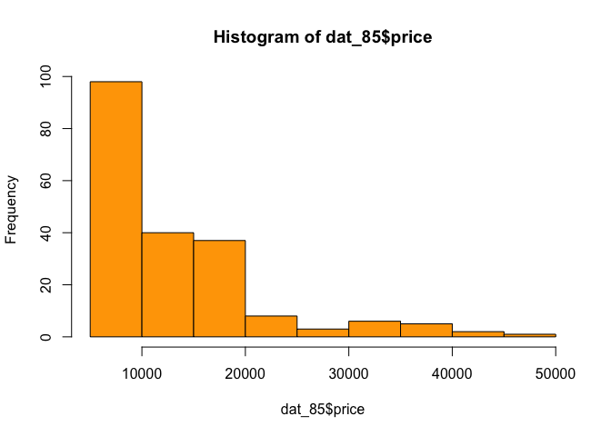

``` r
##boxplot of horsepower in horizzontal orientation
boxplot(dat_85$horsepower, horizontal = TRUE)
```


``` r
##barplot of the frequencies of body_style, arranged in decreasing order
barplot(height = frequency(dat_85$body_style, offset(0)))
```

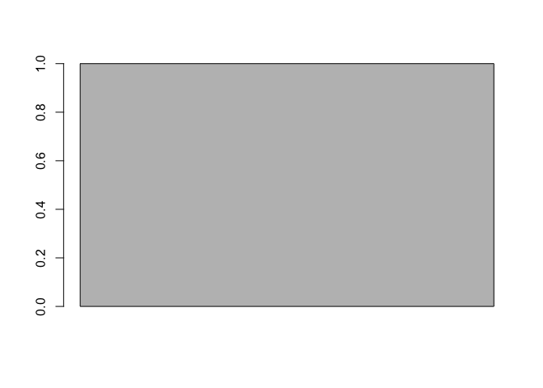

``` r
##stars() plotting
x <- data.frame(c(dat_85$wheel_base,dat_85$length,dat_85$width,dat_85$height,dat_85$price)
                )
x
```

    ##      c.dat_85.wheel_base..dat_85.length..dat_85.width..dat_85.height..
    ## 1                                                                 88.6
    ## 2                                                                 94.5
    ## 3                                                                 99.8
    ## 4                                                                 99.4
    ## 5                                                                 99.8
    ## 6                                                                105.8
    ## 7                                                                105.8
    ## 8                                                                105.8
    ## 9                                                                 99.5
    ## 10                                                               101.2
    ## 11                                                               101.2
    ## 12                                                               101.2
    ## 13                                                               101.2
    ## 14                                                               103.5
    ## 15                                                               103.5
    ## 16                                                               103.5
    ## 17                                                               110.0
    ## 18                                                                88.4
    ## 19                                                                94.5
    ## 20                                                                94.5
    ## 21                                                                93.7
    ## 22                                                                93.7
    ## 23                                                                93.7
    ## 24                                                                93.7
    ## 25                                                                93.7
    ## 26                                                                93.7
    ## 27                                                                93.7
    ## 28                                                               103.3
    ## 29                                                                95.9
    ## 30                                                                86.6
    ## 31                                                                86.6
    ## 32                                                                93.7
    ## 33                                                                93.7
    ## 34                                                                93.7
    ## 35                                                                96.5
    ## 36                                                                96.5
    ## 37                                                                96.5
    ## 38                                                                96.5
    ## 39                                                                96.5
    ## 40                                                                96.5
    ## 41                                                                96.5
    ## 42                                                                96.5
    ## 43                                                                94.3
    ## 44                                                                94.5
    ## 45                                                                94.5
    ## 46                                                                96.0
    ## 47                                                               113.0
    ## 48                                                               113.0
    ## 49                                                               102.0
    ## 50                                                                93.1
    ## 51                                                                93.1
    ## 52                                                                93.1
    ## 53                                                                93.1
    ## 54                                                                93.1
    ## 55                                                                95.3
    ## 56                                                                95.3
    ## 57                                                                95.3
    ## 58                                                                95.3
    ## 59                                                                98.8
    ## 60                                                                98.8
    ## 61                                                                98.8
    ## 62                                                                98.8
    ## 63                                                                98.8
    ## 64                                                                98.8
    ## 65                                                               104.9
    ## 66                                                               104.9
    ## 67                                                               110.0
    ## 68                                                               110.0
    ## 69                                                               106.7
    ## 70                                                               115.6
    ## 71                                                               115.6
    ## 72                                                                96.6
    ## 73                                                               120.9
    ## 74                                                               112.0
    ## 75                                                               102.7
    ## 76                                                                93.7
    ## 77                                                                93.7
    ## 78                                                                93.7
    ## 79                                                                93.0
    ## 80                                                                96.3
    ## 81                                                                96.3
    ## 82                                                                95.9
    ## 83                                                                95.9
    ## 84                                                                95.9
    ## 85                                                                96.3
    ## 86                                                                96.3
    ## 87                                                                96.3
    ## 88                                                                96.3
    ## 89                                                                94.5
    ## 90                                                                94.5
    ## 91                                                                94.5
    ## 92                                                                94.5
    ## 93                                                                94.5
    ## 94                                                                94.5
    ## 95                                                                94.5
    ## 96                                                                94.5
    ## 97                                                                94.5
    ## 98                                                                95.1
    ## 99                                                                97.2
    ## 100                                                               97.2
    ## 101                                                              100.4
    ## 102                                                              100.4
    ## 103                                                              100.4
    ## 104                                                               91.3
    ## 105                                                               91.3
    ## 106                                                               99.2
    ## 107                                                              107.9
    ## 108                                                              107.9
    ## 109                                                              114.2
    ## 110                                                              114.2
    ## 111                                                              107.9
    ## 112                                                              107.9
    ## 113                                                              114.2
    ## 114                                                              114.2
    ## 115                                                              107.9
    ## 116                                                              107.9
    ## 117                                                              108.0
    ## 118                                                               93.7
    ## 119                                                               93.7
    ## 120                                                               93.7
    ## 121                                                               93.7
    ## 122                                                               93.7
    ## 123                                                              103.3
    ## 124                                                               95.9
    ## 125                                                               94.5
    ## 126                                                               89.5
    ## 127                                                               89.5
    ## 128                                                               89.5
    ## 129                                                               98.4
    ## 130                                                               96.1
    ## 131                                                               96.1
    ## 132                                                               99.1
    ## 133                                                               99.1
    ## 134                                                               99.1
    ## 135                                                               99.1
    ## 136                                                               99.1
    ## 137                                                               99.1
    ## 138                                                               93.7
    ## 139                                                               93.7
    ## 140                                                               93.3
    ## 141                                                               97.2
    ## 142                                                               97.2
    ## 143                                                               97.2
    ## 144                                                               97.0
    ## 145                                                               97.0
    ## 146                                                               97.0
    ## 147                                                               97.0
    ## 148                                                               96.9
    ## 149                                                               96.9
    ## 150                                                               95.7
    ## 151                                                               95.7
    ## 152                                                               95.7
    ## 153                                                               95.7
    ## 154                                                               95.7
    ## 155                                                               95.7
    ## 156                                                               95.7
    ## 157                                                               95.7
    ## 158                                                               95.7
    ## 159                                                               95.7
    ## 160                                                               95.7
    ## 161                                                               95.7
    ## 162                                                               95.7
    ## 163                                                               94.5
    ## 164                                                               94.5
    ## 165                                                               94.5
    ## 166                                                               94.5
    ## 167                                                               98.4
    ## 168                                                               98.4
    ## 169                                                               98.4
    ## 170                                                               98.4
    ## 171                                                               98.4
    ## 172                                                               98.4
    ## 173                                                              102.4
    ## 174                                                              102.4
    ## 175                                                              102.4
    ## 176                                                              102.4
    ## 177                                                              102.4
    ## 178                                                              102.9
    ## 179                                                              102.9
    ## 180                                                              104.5
    ## 181                                                              104.5
    ## 182                                                               97.3
    ## 183                                                               97.3
    ## 184                                                               97.3
    ## 185                                                               97.3
    ## 186                                                               97.3
    ## 187                                                               97.3
    ## 188                                                               97.3
    ## 189                                                               94.5
    ## 190                                                               94.5
    ## 191                                                              100.4
    ## 192                                                              100.4
    ## 193                                                              100.4
    ## 194                                                              104.3
    ## 195                                                              104.3
    ## 196                                                              104.3
    ## 197                                                              104.3
    ## 198                                                              104.3
    ## 199                                                              104.3
    ## 200                                                              109.1
    ## 201                                                              109.1
    ## 202                                                              109.1
    ## 203                                                              109.1
    ## 204                                                              109.1
    ## 205                                                              168.8
    ## 206                                                              171.2
    ## 207                                                              176.6
    ## 208                                                              176.6
    ## 209                                                              177.3
    ## 210                                                              192.7
    ## 211                                                              192.7
    ## 212                                                              192.7
    ## 213                                                              178.2
    ## 214                                                              176.8
    ## 215                                                              176.8
    ## 216                                                              176.8
    ## 217                                                              176.8
    ## 218                                                              189.0
    ## 219                                                              189.0
    ## 220                                                              193.8
    ## 221                                                              197.0
    ## 222                                                              141.1
    ## 223                                                              155.9
    ## 224                                                              158.8
    ## 225                                                              157.3
    ## 226                                                              157.3
    ## 227                                                              157.3
    ## 228                                                              157.3
    ## 229                                                              157.3
    ## 230                                                              157.3
    ## 231                                                              157.3
    ## 232                                                              174.6
    ## 233                                                              173.2
    ## 234                                                              144.6
    ## 235                                                              144.6
    ## 236                                                              150.0
    ## 237                                                              150.0
    ## 238                                                              150.0
    ## 239                                                              163.4
    ## 240                                                              157.1
    ## 241                                                              167.5
    ## 242                                                              167.5
    ## 243                                                              175.4
    ## 244                                                              175.4
    ## 245                                                              175.4
    ## 246                                                              169.1
    ## 247                                                              170.7
    ## 248                                                              155.9
    ## 249                                                              155.9
    ## 250                                                              172.6
    ## 251                                                              199.6
    ## 252                                                              199.6
    ## 253                                                              191.7
    ## 254                                                              159.1
    ## 255                                                              159.1
    ## 256                                                              159.1
    ## 257                                                              166.8
    ## 258                                                              166.8
    ## 259                                                              169.0
    ## 260                                                              169.0
    ## 261                                                              169.0
    ## 262                                                              169.0
    ## 263                                                              177.8
    ## 264                                                              177.8
    ## 265                                                              177.8
    ## 266                                                              177.8
    ## 267                                                              177.8
    ## 268                                                              177.8
    ## 269                                                              175.0
    ## 270                                                              175.0
    ## 271                                                              190.9
    ## 272                                                              190.9
    ## 273                                                              187.5
    ## 274                                                              202.6
    ## 275                                                              202.6
    ## 276                                                              180.3
    ## 277                                                              208.1
    ## 278                                                              199.2
    ## 279                                                              178.4
    ## 280                                                              157.3
    ## 281                                                              157.3
    ## 282                                                              157.3
    ## 283                                                              157.3
    ## 284                                                              173.0
    ## 285                                                              173.0
    ## 286                                                              173.2
    ## 287                                                              173.2
    ## 288                                                              173.2
    ## 289                                                              172.4
    ## 290                                                              172.4
    ## 291                                                              172.4
    ## 292                                                              172.4
    ## 293                                                              165.3
    ## 294                                                              165.3
    ## 295                                                              165.3
    ## 296                                                              165.3
    ## 297                                                              170.2
    ## 298                                                              165.3
    ## 299                                                              165.6
    ## 300                                                              165.3
    ## 301                                                              170.2
    ## 302                                                              162.4
    ## 303                                                              173.4
    ## 304                                                              173.4
    ## 305                                                              181.7
    ## 306                                                              184.6
    ## 307                                                              184.6
    ## 308                                                              170.7
    ## 309                                                              170.7
    ## 310                                                              178.5
    ## 311                                                              186.7
    ## 312                                                              186.7
    ## 313                                                              198.9
    ## 314                                                              198.9
    ## 315                                                              186.7
    ## 316                                                              186.7
    ## 317                                                              198.9
    ## 318                                                              198.9
    ## 319                                                              186.7
    ## 320                                                              186.7
    ## 321                                                              186.7
    ## 322                                                              157.3
    ## 323                                                              157.3
    ## 324                                                              157.3
    ## 325                                                              167.3
    ## 326                                                              167.3
    ## 327                                                              174.6
    ## 328                                                              173.2
    ## 329                                                              168.9
    ## 330                                                              168.9
    ## 331                                                              168.9
    ## 332                                                              168.9
    ## 333                                                              175.7
    ## 334                                                              181.5
    ## 335                                                              176.8
    ## 336                                                              186.6
    ## 337                                                              186.6
    ## 338                                                              186.6
    ## 339                                                              186.6
    ## 340                                                              186.6
    ## 341                                                              186.6
    ## 342                                                              156.9
    ## 343                                                              157.9
    ## 344                                                              157.3
    ## 345                                                              172.0
    ## 346                                                              172.0
    ## 347                                                              172.0
    ## 348                                                              172.0
    ## 349                                                              172.0
    ## 350                                                              173.5
    ## 351                                                              173.5
    ## 352                                                              173.6
    ## 353                                                              173.6
    ## 354                                                              158.7
    ## 355                                                              158.7
    ## 356                                                              158.7
    ## 357                                                              169.7
    ## 358                                                              169.7
    ## 359                                                              169.7
    ## 360                                                              166.3
    ## 361                                                              166.3
    ## 362                                                              166.3
    ## 363                                                              166.3
    ## 364                                                              166.3
    ## 365                                                              166.3
    ## 366                                                              166.3
    ## 367                                                              168.7
    ## 368                                                              168.7
    ## 369                                                              168.7
    ## 370                                                              168.7
    ## 371                                                              176.2
    ## 372                                                              176.2
    ## 373                                                              176.2
    ## 374                                                              176.2
    ## 375                                                              176.2
    ## 376                                                              176.2
    ## 377                                                              175.6
    ## 378                                                              175.6
    ## 379                                                              175.6
    ## 380                                                              175.6
    ## 381                                                              175.6
    ## 382                                                              183.5
    ## 383                                                              183.5
    ## 384                                                              187.8
    ## 385                                                              187.8
    ## 386                                                              171.7
    ## 387                                                              171.7
    ## 388                                                              171.7
    ## 389                                                              171.7
    ## 390                                                              171.7
    ## 391                                                              171.7
    ## 392                                                              171.7
    ## 393                                                              159.3
    ## 394                                                              165.7
    ## 395                                                              180.2
    ## 396                                                              180.2
    ## 397                                                              183.1
    ## 398                                                              188.8
    ## 399                                                              188.8
    ## 400                                                              188.8
    ## 401                                                              188.8
    ## 402                                                              188.8
    ## 403                                                              188.8
    ## 404                                                              188.8
    ## 405                                                              188.8
    ## 406                                                              188.8
    ## 407                                                              188.8
    ## 408                                                              188.8
    ## 409                                                               64.1
    ## 410                                                               65.5
    ## 411                                                               66.2
    ## 412                                                               66.4
    ## 413                                                               66.3
    ## 414                                                               71.4
    ## 415                                                               71.4
    ## 416                                                               71.4
    ## 417                                                               67.9
    ## 418                                                               64.8
    ## 419                                                               64.8
    ## 420                                                               64.8
    ## 421                                                               64.8
    ## 422                                                               66.9
    ## 423                                                               66.9
    ## 424                                                               67.9
    ## 425                                                               70.9
    ## 426                                                               60.3
    ## 427                                                               63.6
    ## 428                                                               63.6
    ## 429                                                               63.8
    ## 430                                                               63.8
    ## 431                                                               63.8
    ## 432                                                               63.8
    ## 433                                                               63.8
    ## 434                                                               63.8
    ## 435                                                               63.8
    ## 436                                                               64.6
    ## 437                                                               66.3
    ## 438                                                               63.9
    ## 439                                                               63.9
    ## 440                                                               64.0
    ## 441                                                               64.0
    ## 442                                                               64.0
    ## 443                                                               64.0
    ## 444                                                               63.9
    ## 445                                                               65.2
    ## 446                                                               65.2
    ## 447                                                               65.2
    ## 448                                                               62.5
    ## 449                                                               65.2
    ## 450                                                               66.0
    ## 451                                                               61.8
    ## 452                                                               63.6
    ## 453                                                               63.6
    ## 454                                                               65.2
    ## 455                                                               69.6
    ## 456                                                               69.6
    ## 457                                                               70.6
    ## 458                                                               64.2
    ## 459                                                               64.2
    ## 460                                                               64.2
    ## 461                                                               64.2
    ## 462                                                               64.2
    ## 463                                                               65.7
    ## 464                                                               65.7
    ## 465                                                               65.7
    ## 466                                                               65.7
    ## 467                                                               66.5
    ## 468                                                               66.5
    ## 469                                                               66.5
    ## 470                                                               66.5
    ## 471                                                               66.5
    ## 472                                                               66.5
    ## 473                                                               66.1
    ## 474                                                               66.1
    ## 475                                                               70.3
    ## 476                                                               70.3
    ## 477                                                               70.3
    ## 478                                                               71.7
    ## 479                                                               71.7
    ## 480                                                               70.5
    ## 481                                                               71.7
    ## 482                                                               72.0
    ## 483                                                               68.0
    ## 484                                                               64.4
    ## 485                                                               64.4
    ## 486                                                               64.4
    ## 487                                                               63.8
    ## 488                                                               65.4
    ## 489                                                               65.4
    ## 490                                                               66.3
    ## 491                                                               66.3
    ## 492                                                               66.3
    ## 493                                                               65.4
    ## 494                                                               65.4
    ## 495                                                               65.4
    ## 496                                                               65.4
    ## 497                                                               63.8
    ## 498                                                               63.8
    ## 499                                                               63.8
    ## 500                                                               63.8
    ## 501                                                               63.8
    ## 502                                                               63.8
    ## 503                                                               63.8
    ## 504                                                               63.8
    ## 505                                                               63.8
    ## 506                                                               63.8
    ## 507                                                               65.2
    ## 508                                                               65.2
    ## 509                                                               66.5
    ## 510                                                               66.5
    ## 511                                                               66.5
    ## 512                                                               67.9
    ## 513                                                               67.9
    ## 514                                                               67.9
    ## 515                                                               68.4
    ## 516                                                               68.4
    ## 517                                                               68.4
    ## 518                                                               68.4
    ## 519                                                               68.4
    ## 520                                                               68.4
    ## 521                                                               68.4
    ## 522                                                               68.4
    ## 523                                                               68.4
    ## 524                                                               68.4
    ## 525                                                               68.3
    ## 526                                                               63.8
    ## 527                                                               63.8
    ## 528                                                               63.8
    ## 529                                                               63.8
    ## 530                                                               63.8
    ## 531                                                               64.6
    ## 532                                                               66.3
    ## 533                                                               68.3
    ## 534                                                               65.0
    ## 535                                                               65.0
    ## 536                                                               65.0
    ## 537                                                               72.3
    ## 538                                                               66.5
    ## 539                                                               66.6
    ## 540                                                               66.5
    ## 541                                                               66.5
    ## 542                                                               66.5
    ## 543                                                               66.5
    ## 544                                                               66.5
    ## 545                                                               66.5
    ## 546                                                               63.4
    ## 547                                                               63.6
    ## 548                                                               63.8
    ## 549                                                               65.4
    ## 550                                                               65.4
    ## 551                                                               65.4
    ## 552                                                               65.4
    ## 553                                                               65.4
    ## 554                                                               65.4
    ## 555                                                               65.4
    ## 556                                                               65.4
    ## 557                                                               65.4
    ## 558                                                               63.6
    ## 559                                                               63.6
    ## 560                                                               63.6
    ## 561                                                               63.6
    ## 562                                                               63.6
    ## 563                                                               63.6
    ## 564                                                               64.4
    ## 565                                                               64.4
    ## 566                                                               64.4
    ## 567                                                               64.4
    ## 568                                                               64.4
    ## 569                                                               64.4
    ## 570                                                               64.4
    ## 571                                                               64.0
    ## 572                                                               64.0
    ## 573                                                               64.0
    ## 574                                                               64.0
    ## 575                                                               65.6
    ## 576                                                               65.6
    ## 577                                                               65.6
    ## 578                                                               65.6
    ## 579                                                               65.6
    ## 580                                                               65.6
    ## 581                                                               66.5
    ## 582                                                               66.5
    ## 583                                                               66.5
    ## 584                                                               66.5
    ## 585                                                               66.5
    ## 586                                                               67.7
    ## 587                                                               67.7
    ## 588                                                               66.5
    ## 589                                                               66.5
    ## 590                                                               65.5
    ## 591                                                               65.5
    ## 592                                                               65.5
    ## 593                                                               65.5
    ## 594                                                               65.5
    ## 595                                                               65.5
    ## 596                                                               65.5
    ## 597                                                               64.2
    ## 598                                                               64.0
    ## 599                                                               66.9
    ## 600                                                               66.9
    ## 601                                                               66.9
    ## 602                                                               67.2
    ## 603                                                               67.2
    ## 604                                                               67.2
    ## 605                                                               67.2
    ## 606                                                               67.2
    ## 607                                                               67.2
    ## 608                                                               68.9
    ## 609                                                               68.8
    ## 610                                                               68.9
    ## 611                                                               68.9
    ## 612                                                               68.9
    ## 613                                                               48.8
    ## 614                                                               52.4
    ## 615                                                               54.3
    ## 616                                                               54.3
    ## 617                                                               53.1
    ## 618                                                               55.7
    ## 619                                                               55.7
    ## 620                                                               55.9
    ## 621                                                               52.0
    ## 622                                                               54.3
    ## 623                                                               54.3
    ## 624                                                               54.3
    ## 625                                                               54.3
    ## 626                                                               55.7
    ## 627                                                               55.7
    ## 628                                                               53.7
    ## 629                                                               56.3
    ## 630                                                               53.2
    ## 631                                                               52.0
    ## 632                                                               52.0
    ## 633                                                               50.8
    ## 634                                                               50.8
    ## 635                                                               50.8
    ## 636                                                               50.6
    ## 637                                                               50.6
    ## 638                                                               50.6
    ## 639                                                               50.6
    ## 640                                                               59.8
    ## 641                                                               50.2
    ## 642                                                               50.8
    ## 643                                                               50.8
    ## 644                                                               52.6
    ## 645                                                               52.6
    ## 646                                                               52.6
    ## 647                                                               54.5
    ## 648                                                               58.3
    ## 649                                                               53.3
    ## 650                                                               53.3
    ## 651                                                               54.1
    ## 652                                                               54.1
    ## 653                                                               54.1
    ## 654                                                               51.0
    ## 655                                                               53.5
    ## 656                                                               52.0
    ## 657                                                               52.0
    ## 658                                                               51.4
    ## 659                                                               52.8
    ## 660                                                               52.8
    ## 661                                                               47.8
    ## 662                                                               54.1
    ## 663                                                               54.1
    ## 664                                                               54.1
    ## 665                                                               54.1
    ## 666                                                               54.1
    ## 667                                                               49.6
    ## 668                                                               49.6
    ## 669                                                               49.6
    ## 670                                                               49.6
    ## 671                                                               53.7
    ## 672                                                               55.5
    ## 673                                                               53.7
    ## 674                                                               55.5
    ## 675                                                               55.5
    ## 676                                                               55.5
    ## 677                                                               54.4
    ## 678                                                               54.4
    ## 679                                                               56.5
    ## 680                                                               58.7
    ## 681                                                               54.9
    ## 682                                                               56.3
    ## 683                                                               56.5
    ## 684                                                               50.8
    ## 685                                                               56.7
    ## 686                                                               55.4
    ## 687                                                               54.8
    ## 688                                                               50.8
    ## 689                                                               50.8
    ## 690                                                               50.8
    ## 691                                                               50.8
    ## 692                                                               49.4
    ## 693                                                               49.4
    ## 694                                                               50.2
    ## 695                                                               50.2
    ## 696                                                               50.2
    ## 697                                                               51.6
    ## 698                                                               51.6
    ## 699                                                               51.6
    ## 700                                                               51.6
    ## 701                                                               54.5
    ## 702                                                               54.5
    ## 703                                                               54.5
    ## 704                                                               54.5
    ## 705                                                               53.5
    ## 706                                                               54.5
    ## 707                                                               53.3
    ## 708                                                               54.5
    ## 709                                                               53.5
    ## 710                                                               53.3
    ## 711                                                               54.7
    ## 712                                                               54.7
    ## 713                                                               55.1
    ## 714                                                               56.1
    ## 715                                                               55.1
    ## 716                                                               49.7
    ## 717                                                               49.7
    ## 718                                                               49.7
    ## 719                                                               56.7
    ## 720                                                               56.7
    ## 721                                                               58.7
    ## 722                                                               58.7
    ## 723                                                               56.7
    ## 724                                                               56.7
    ## 725                                                               56.7
    ## 726                                                               58.7
    ## 727                                                               56.7
    ## 728                                                               56.7
    ## 729                                                               56.0
    ## 730                                                               50.8
    ## 731                                                               50.8
    ## 732                                                               50.6
    ## 733                                                               50.8
    ## 734                                                               50.8
    ## 735                                                               59.8
    ## 736                                                               50.2
    ## 737                                                               50.2
    ## 738                                                               51.6
    ## 739                                                               51.6
    ## 740                                                               51.6
    ## 741                                                               50.5
    ## 742                                                               55.2
    ## 743                                                               50.5
    ## 744                                                               56.1
    ## 745                                                               56.1
    ## 746                                                               56.1
    ## 747                                                               56.1
    ## 748                                                               56.1
    ## 749                                                               56.1
    ## 750                                                               53.7
    ## 751                                                               53.7
    ## 752                                                               55.7
    ## 753                                                               52.5
    ## 754                                                               52.5
    ## 755                                                               52.5
    ## 756                                                               54.3
    ## 757                                                               54.3
    ## 758                                                               53.0
    ## 759                                                               53.0
    ## 760                                                               54.9
    ## 761                                                               54.9
    ## 762                                                               54.5
    ## 763                                                               54.5
    ## 764                                                               54.5
    ## 765                                                               59.1
    ## 766                                                               59.1
    ## 767                                                               59.1
    ## 768                                                               53.0
    ## 769                                                               52.8
    ## 770                                                               53.0
    ## 771                                                               52.8
    ## 772                                                               53.0
    ## 773                                                               52.8
    ## 774                                                               52.8
    ## 775                                                               52.6
    ## 776                                                               52.6
    ## 777                                                               52.6
    ## 778                                                               52.6
    ## 779                                                               52.0
    ## 780                                                               52.0
    ## 781                                                               52.0
    ## 782                                                               52.0
    ## 783                                                               52.0
    ## 784                                                               53.0
    ## 785                                                               54.9
    ## 786                                                               54.9
    ## 787                                                               53.9
    ## 788                                                               54.9
    ## 789                                                               53.9
    ## 790                                                               52.0
    ## 791                                                               52.0
    ## 792                                                               54.1
    ## 793                                                               54.1
    ## 794                                                               55.7
    ## 795                                                               55.7
    ## 796                                                               55.7
    ## 797                                                               55.7
    ## 798                                                               55.7
    ## 799                                                               55.7
    ## 800                                                               55.7
    ## 801                                                               55.6
    ## 802                                                               51.4
    ## 803                                                               55.1
    ## 804                                                               55.1
    ## 805                                                               55.1
    ## 806                                                               56.2
    ## 807                                                               57.5
    ## 808                                                               56.2
    ## 809                                                               57.5
    ## 810                                                               56.2
    ## 811                                                               57.5
    ## 812                                                               55.5
    ## 813                                                               55.5
    ## 814                                                               55.5
    ## 815                                                               55.5
    ## 816                                                               55.5
    ## 817                                                            16500.0
    ## 818                                                            16500.0
    ## 819                                                            13950.0
    ## 820                                                            17450.0
    ## 821                                                            15250.0
    ## 822                                                            17710.0
    ## 823                                                            18920.0
    ## 824                                                            23875.0
    ## 825                                                                 NA
    ## 826                                                            16430.0
    ## 827                                                            16925.0
    ## 828                                                            20970.0
    ## 829                                                            21105.0
    ## 830                                                            24565.0
    ## 831                                                            30760.0
    ## 832                                                            41315.0
    ## 833                                                            36880.0
    ## 834                                                             5151.0
    ## 835                                                             6295.0
    ## 836                                                             6575.0
    ## 837                                                             5572.0
    ## 838                                                             6377.0
    ## 839                                                             7957.0
    ## 840                                                             6229.0
    ## 841                                                             6692.0
    ## 842                                                             7609.0
    ## 843                                                             8558.0
    ## 844                                                             8921.0
    ## 845                                                            12964.0
    ## 846                                                             6479.0
    ## 847                                                             6855.0
    ## 848                                                             5399.0
    ## 849                                                             6529.0
    ## 850                                                             7129.0
    ## 851                                                             7295.0
    ## 852                                                             7295.0
    ## 853                                                             7895.0
    ## 854                                                             9095.0
    ## 855                                                             8845.0
    ## 856                                                            10295.0
    ## 857                                                            12945.0
    ## 858                                                            10345.0
    ## 859                                                             6785.0
    ## 860                                                                 NA
    ## 861                                                                 NA
    ## 862                                                            11048.0
    ## 863                                                            32250.0
    ## 864                                                            35550.0
    ## 865                                                            36000.0
    ## 866                                                             5195.0
    ## 867                                                             6095.0
    ## 868                                                             6795.0
    ## 869                                                             6695.0
    ## 870                                                             7395.0
    ## 871                                                            10945.0
    ## 872                                                            11845.0
    ## 873                                                            13645.0
    ## 874                                                            15645.0
    ## 875                                                             8845.0
    ## 876                                                             8495.0
    ## 877                                                            10595.0
    ## 878                                                            10245.0
    ## 879                                                            10795.0
    ## 880                                                            11245.0
    ## 881                                                            18280.0
    ## 882                                                            18344.0
    ## 883                                                            25552.0
    ## 884                                                            28248.0
    ## 885                                                            28176.0
    ## 886                                                            31600.0
    ## 887                                                            34184.0
    ## 888                                                            35056.0
    ## 889                                                            40960.0
    ## 890                                                            45400.0
    ## 891                                                            16503.0
    ## 892                                                             5389.0
    ## 893                                                             6189.0
    ## 894                                                             6669.0
    ## 895                                                             7689.0
    ## 896                                                             9959.0
    ## 897                                                             8499.0
    ## 898                                                            12629.0
    ## 899                                                            14869.0
    ## 900                                                            14489.0
    ## 901                                                             6989.0
    ## 902                                                             8189.0
    ## 903                                                             9279.0
    ## 904                                                             9279.0
    ## 905                                                             5499.0
    ## 906                                                             7099.0
    ## 907                                                             6649.0
    ## 908                                                             6849.0
    ## 909                                                             7349.0
    ## 910                                                             7299.0
    ## 911                                                             7799.0
    ## 912                                                             7499.0
    ## 913                                                             7999.0
    ## 914                                                             8249.0
    ## 915                                                             8949.0
    ## 916                                                             9549.0
    ## 917                                                            13499.0
    ## 918                                                            14399.0
    ## 919                                                            13499.0
    ## 920                                                            17199.0
    ## 921                                                            19699.0
    ## 922                                                            18399.0
    ## 923                                                            11900.0
    ## 924                                                            13200.0
    ## 925                                                            12440.0
    ## 926                                                            13860.0
    ## 927                                                            15580.0
    ## 928                                                            16900.0
    ## 929                                                            16695.0
    ## 930                                                            17075.0
    ## 931                                                            16630.0
    ## 932                                                            17950.0
    ## 933                                                            18150.0
    ## 934                                                             5572.0
    ## 935                                                             7957.0
    ## 936                                                             6229.0
    ## 937                                                             6692.0
    ## 938                                                             7609.0
    ## 939                                                             8921.0
    ## 940                                                            12764.0
    ## 941                                                            22018.0
    ## 942                                                            32528.0
    ## 943                                                            34028.0
    ## 944                                                            37028.0
    ## 945                                                                 NA
    ## 946                                                             9295.0
    ## 947                                                             9895.0
    ## 948                                                            11850.0
    ## 949                                                            12170.0
    ## 950                                                            15040.0
    ## 951                                                            15510.0
    ## 952                                                            18150.0
    ## 953                                                            18620.0
    ## 954                                                             5118.0
    ## 955                                                             7053.0
    ## 956                                                             7603.0
    ## 957                                                             7126.0
    ## 958                                                             7775.0
    ## 959                                                             9960.0
    ## 960                                                             9233.0
    ## 961                                                            11259.0
    ## 962                                                             7463.0
    ## 963                                                            10198.0
    ## 964                                                             8013.0
    ## 965                                                            11694.0
    ## 966                                                             5348.0
    ## 967                                                             6338.0
    ## 968                                                             6488.0
    ## 969                                                             6918.0
    ## 970                                                             7898.0
    ## 971                                                             8778.0
    ## 972                                                             6938.0
    ## 973                                                             7198.0
    ## 974                                                             7898.0
    ## 975                                                             7788.0
    ## 976                                                             7738.0
    ## 977                                                             8358.0
    ## 978                                                             9258.0
    ## 979                                                             8058.0
    ## 980                                                             8238.0
    ## 981                                                             9298.0
    ## 982                                                             9538.0
    ## 983                                                             8449.0
    ## 984                                                             9639.0
    ## 985                                                             9989.0
    ## 986                                                            11199.0
    ## 987                                                            11549.0
    ## 988                                                            17669.0
    ## 989                                                             8948.0
    ## 990                                                            10698.0
    ## 991                                                             9988.0
    ## 992                                                            10898.0
    ## 993                                                            11248.0
    ## 994                                                            16558.0
    ## 995                                                            15998.0
    ## 996                                                            15690.0
    ## 997                                                            15750.0
    ## 998                                                             7775.0
    ## 999                                                             7975.0
    ## 1000                                                            7995.0
    ## 1001                                                            8195.0
    ## 1002                                                            8495.0
    ## 1003                                                            9495.0
    ## 1004                                                            9995.0
    ## 1005                                                           11595.0
    ## 1006                                                            9980.0
    ## 1007                                                           13295.0
    ## 1008                                                           13845.0
    ## 1009                                                           12290.0
    ## 1010                                                           12940.0
    ## 1011                                                           13415.0
    ## 1012                                                           15985.0
    ## 1013                                                           16515.0
    ## 1014                                                           18420.0
    ## 1015                                                           18950.0
    ## 1016                                                           16845.0
    ## 1017                                                           19045.0
    ## 1018                                                           21485.0
    ## 1019                                                           22470.0
    ## 1020                                                           22625.0

``` r
stars(x, nrow = 70, ncol = 100, len = 500)
```

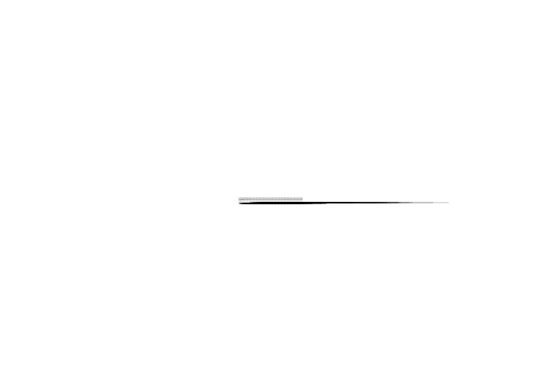

5) Summaries
============

``` r
dat_85
```

    ##     symboling normalized_losses          make fuel_type aspirations
    ## 1           3              <NA>   alfa-romero       gas         std
    ## 2           1              <NA>   alfa-romero       gas         std
    ## 3           2               164          audi       gas         std
    ## 4           2               164          audi       gas         std
    ## 5           2              <NA>          audi       gas         std
    ## 6           1               158          audi       gas         std
    ## 7           1              <NA>          audi       gas         std
    ## 8           1               158          audi       gas       turbo
    ## 9           0              <NA>          audi       gas       turbo
    ## 10          2               192           bmw       gas         std
    ## 11          0               192           bmw       gas         std
    ## 12          0               188           bmw       gas         std
    ## 13          0               188           bmw       gas         std
    ## 14          1              <NA>           bmw       gas         std
    ## 15          0              <NA>           bmw       gas         std
    ## 16          0              <NA>           bmw       gas         std
    ## 17          0              <NA>           bmw       gas         std
    ## 18          2               121     chevrolet       gas         std
    ## 19          1                98     chevrolet       gas         std
    ## 20          0                81     chevrolet       gas         std
    ## 21          1               118         dodge       gas         std
    ## 22          1               118         dodge       gas         std
    ## 23          1               118         dodge       gas       turbo
    ## 24          1               148         dodge       gas         std
    ## 25          1               148         dodge       gas         std
    ## 26          1               148         dodge       gas         std
    ## 27          1               148         dodge       gas       turbo
    ## 28         -1               110         dodge       gas         std
    ## 29          3               145         dodge       gas       turbo
    ## 30          2               137         honda       gas         std
    ## 31          2               137         honda       gas         std
    ## 32          1               101         honda       gas         std
    ## 33          1               101         honda       gas         std
    ## 34          1               101         honda       gas         std
    ## 35          0               110         honda       gas         std
    ## 36          0                78         honda       gas         std
    ## 37          0               106         honda       gas         std
    ## 38          0               106         honda       gas         std
    ## 39          0                85         honda       gas         std
    ## 40          0                85         honda       gas         std
    ## 41          0                85         honda       gas         std
    ## 42          1               107         honda       gas         std
    ## 43          0              <NA>         isuzu       gas         std
    ## 44          1              <NA>         isuzu       gas         std
    ## 45          0              <NA>         isuzu       gas         std
    ## 46          2              <NA>         isuzu       gas         std
    ## 47          0               145        jaguar       gas         std
    ## 48          0              <NA>        jaguar       gas         std
    ## 49          0              <NA>        jaguar       gas         std
    ## 50          1               104         mazda       gas         std
    ## 51          1               104         mazda       gas         std
    ## 52          1               104         mazda       gas         std
    ## 53          1               113         mazda       gas         std
    ## 54          1               113         mazda       gas         std
    ## 55          3               150         mazda       gas         std
    ## 56          3               150         mazda       gas         std
    ## 57          3               150         mazda       gas         std
    ## 58          3               150         mazda       gas         std
    ## 59          1               129         mazda       gas         std
    ## 60          0               115         mazda       gas         std
    ## 61          1               129         mazda       gas         std
    ## 62          0               115         mazda       gas         std
    ## 63          0              <NA>         mazda    diesel         std
    ## 64          0               115         mazda       gas         std
    ## 65          0               118         mazda       gas         std
    ## 66          0              <NA>         mazda    diesel         std
    ## 67         -1                93 mercedes-benz    diesel       turbo
    ## 68         -1                93 mercedes-benz    diesel       turbo
    ## 69          0                93 mercedes-benz    diesel       turbo
    ## 70         -1                93 mercedes-benz    diesel       turbo
    ## 71         -1              <NA> mercedes-benz       gas         std
    ## 72          3               142 mercedes-benz       gas         std
    ## 73          0              <NA> mercedes-benz       gas         std
    ## 74          1              <NA> mercedes-benz       gas         std
    ## 75          1              <NA>       mercury       gas       turbo
    ## 76          2               161    mitsubishi       gas         std
    ## 77          2               161    mitsubishi       gas         std
    ## 78          2               161    mitsubishi       gas         std
    ## 79          1               161    mitsubishi       gas       turbo
    ## 80          3               153    mitsubishi       gas       turbo
    ## 81          3               153    mitsubishi       gas         std
    ## 82          3              <NA>    mitsubishi       gas       turbo
    ## 83          3              <NA>    mitsubishi       gas       turbo
    ## 84          3              <NA>    mitsubishi       gas       turbo
    ## 85          1               125    mitsubishi       gas         std
    ## 86          1               125    mitsubishi       gas         std
    ## 87          1               125    mitsubishi       gas       turbo
    ## 88         -1               137    mitsubishi       gas         std
    ## 89          1               128        nissan       gas         std
    ## 90          1               128        nissan    diesel         std
    ## 91          1               128        nissan       gas         std
    ## 92          1               122        nissan       gas         std
    ## 93          1               103        nissan       gas         std
    ## 94          1               128        nissan       gas         std
    ## 95          1               128        nissan       gas         std
    ## 96          1               122        nissan       gas         std
    ## 97          1               103        nissan       gas         std
    ## 98          2               168        nissan       gas         std
    ## 99          0               106        nissan       gas         std
    ## 100         0               106        nissan       gas         std
    ## 101         0               128        nissan       gas         std
    ## 102         0               108        nissan       gas         std
    ## 103         0               108        nissan       gas         std
    ## 104         3               194        nissan       gas         std
    ## 105         3               194        nissan       gas       turbo
    ## 106         1               231        nissan       gas         std
    ## 107         0               161        peugot       gas         std
    ## 108         0               161        peugot    diesel       turbo
    ## 109         0              <NA>        peugot       gas         std
    ## 110         0              <NA>        peugot    diesel       turbo
    ## 111         0               161        peugot       gas         std
    ## 112         0               161        peugot    diesel       turbo
    ## 113         0              <NA>        peugot       gas         std
    ## 114         0              <NA>        peugot    diesel       turbo
    ## 115         0               161        peugot       gas         std
    ## 116         0               161        peugot    diesel       turbo
    ## 117         0               161        peugot       gas       turbo
    ## 118         1               119      plymouth       gas         std
    ## 119         1               119      plymouth       gas       turbo
    ## 120         1               154      plymouth       gas         std
    ## 121         1               154      plymouth       gas         std
    ## 122         1               154      plymouth       gas         std
    ## 123        -1                74      plymouth       gas         std
    ## 124         3              <NA>      plymouth       gas       turbo
    ## 125         3               186       porsche       gas         std
    ## 126         3              <NA>       porsche       gas         std
    ## 127         3              <NA>       porsche       gas         std
    ## 128         3              <NA>       porsche       gas         std
    ## 129         1              <NA>       porsche       gas         std
    ## 130         0              <NA>       renault       gas         std
    ## 131         2              <NA>       renault       gas         std
    ## 132         3               150          saab       gas         std
    ## 133         2               104          saab       gas         std
    ## 134         3               150          saab       gas         std
    ## 135         2               104          saab       gas         std
    ## 136         3               150          saab       gas       turbo
    ## 137         2               104          saab       gas       turbo
    ## 138         2                83        subaru       gas         std
    ## 139         2                83        subaru       gas         std
    ## 140         2                83        subaru       gas         std
    ## 141         0               102        subaru       gas         std
    ## 142         0               102        subaru       gas         std
    ## 143         0               102        subaru       gas         std
    ## 144         0               102        subaru       gas         std
    ## 145         0               102        subaru       gas       turbo
    ## 146         0                89        subaru       gas         std
    ## 147         0                89        subaru       gas         std
    ## 148         0                85        subaru       gas         std
    ## 149         0                85        subaru       gas       turbo
    ## 150         1                87        toyota       gas         std
    ## 151         1                87        toyota       gas         std
    ## 152         1                74        toyota       gas         std
    ## 153         0                77        toyota       gas         std
    ## 154         0                81        toyota       gas         std
    ## 155         0                91        toyota       gas         std
    ## 156         0                91        toyota       gas         std
    ## 157         0                91        toyota       gas         std
    ## 158         0                91        toyota    diesel         std
    ## 159         0                91        toyota    diesel         std
    ## 160         0                91        toyota       gas         std
    ## 161         0                91        toyota       gas         std
    ## 162         0                91        toyota       gas         std
    ## 163         1               168        toyota       gas         std
    ## 164         1               168        toyota       gas         std
    ## 165         1               168        toyota       gas         std
    ## 166         1               168        toyota       gas         std
    ## 167         2               134        toyota       gas         std
    ## 168         2               134        toyota       gas         std
    ## 169         2               134        toyota       gas         std
    ## 170         2               134        toyota       gas         std
    ## 171         2               134        toyota       gas         std
    ## 172         2               134        toyota       gas         std
    ## 173        -1                65        toyota       gas         std
    ## 174        -1                65        toyota    diesel       turbo
    ## 175        -1                65        toyota       gas         std
    ## 176        -1                65        toyota       gas         std
    ## 177        -1                65        toyota       gas         std
    ## 178         3               197        toyota       gas         std
    ## 179         3               197        toyota       gas         std
    ## 180        -1                90        toyota       gas         std
    ## 181        -1              <NA>        toyota       gas         std
    ## 182         2               122    volkswagen    diesel         std
    ## 183         2               122    volkswagen       gas         std
    ## 184         2                94    volkswagen    diesel         std
    ## 185         2                94    volkswagen       gas         std
    ## 186         2                94    volkswagen       gas         std
    ## 187         2                94    volkswagen    diesel       turbo
    ## 188         2                94    volkswagen       gas         std
    ## 189         3              <NA>    volkswagen       gas         std
    ## 190         3               256    volkswagen       gas         std
    ## 191         0              <NA>    volkswagen       gas         std
    ## 192         0              <NA>    volkswagen    diesel       turbo
    ## 193         0              <NA>    volkswagen       gas         std
    ## 194        -2               103         volvo       gas         std
    ## 195        -1                74         volvo       gas         std
    ## 196        -2               103         volvo       gas         std
    ## 197        -1                74         volvo       gas         std
    ## 198        -2               103         volvo       gas       turbo
    ## 199        -1                74         volvo       gas       turbo
    ## 200        -1                95         volvo       gas         std
    ## 201        -1                95         volvo       gas       turbo
    ## 202        -1                95         volvo       gas         std
    ## 203        -1                95         volvo    diesel       turbo
    ## 204        -1                95         volvo       gas       turbo
    ##     num_of_doors  body_style drive_wheels engine_location wheel_base
    ## 1            two convertible          rwd           front       88.6
    ## 2            two   hatchback          rwd           front       94.5
    ## 3           four       sedan          fwd           front       99.8
    ## 4           four       sedan          4wd           front       99.4
    ## 5            two       sedan          fwd           front       99.8
    ## 6           four       sedan          fwd           front      105.8
    ## 7           four       wagon          fwd           front      105.8
    ## 8           four       sedan          fwd           front      105.8
    ## 9            two   hatchback          4wd           front       99.5
    ## 10           two       sedan          rwd           front      101.2
    ## 11          four       sedan          rwd           front      101.2
    ## 12           two       sedan          rwd           front      101.2
    ## 13          four       sedan          rwd           front      101.2
    ## 14          four       sedan          rwd           front      103.5
    ## 15          four       sedan          rwd           front      103.5
    ## 16           two       sedan          rwd           front      103.5
    ## 17          four       sedan          rwd           front      110.0
    ## 18           two   hatchback          fwd           front       88.4
    ## 19           two   hatchback          fwd           front       94.5
    ## 20          four       sedan          fwd           front       94.5
    ## 21           two   hatchback          fwd           front       93.7
    ## 22           two   hatchback          fwd           front       93.7
    ## 23           two   hatchback          fwd           front       93.7
    ## 24          four   hatchback          fwd           front       93.7
    ## 25          four       sedan          fwd           front       93.7
    ## 26          four       sedan          fwd           front       93.7
    ## 27          <NA>       sedan          fwd           front       93.7
    ## 28          four       wagon          fwd           front      103.3
    ## 29           two   hatchback          fwd           front       95.9
    ## 30           two   hatchback          fwd           front       86.6
    ## 31           two   hatchback          fwd           front       86.6
    ## 32           two   hatchback          fwd           front       93.7
    ## 33           two   hatchback          fwd           front       93.7
    ## 34           two   hatchback          fwd           front       93.7
    ## 35          four       sedan          fwd           front       96.5
    ## 36          four       wagon          fwd           front       96.5
    ## 37           two   hatchback          fwd           front       96.5
    ## 38           two   hatchback          fwd           front       96.5
    ## 39          four       sedan          fwd           front       96.5
    ## 40          four       sedan          fwd           front       96.5
    ## 41          four       sedan          fwd           front       96.5
    ## 42           two       sedan          fwd           front       96.5
    ## 43          four       sedan          rwd           front       94.3
    ## 44           two       sedan          fwd           front       94.5
    ## 45          four       sedan          fwd           front       94.5
    ## 46           two   hatchback          rwd           front       96.0
    ## 47          four       sedan          rwd           front      113.0
    ## 48          four       sedan          rwd           front      113.0
    ## 49           two       sedan          rwd           front      102.0
    ## 50           two   hatchback          fwd           front       93.1
    ## 51           two   hatchback          fwd           front       93.1
    ## 52           two   hatchback          fwd           front       93.1
    ## 53          four       sedan          fwd           front       93.1
    ## 54          four       sedan          fwd           front       93.1
    ## 55           two   hatchback          rwd           front       95.3
    ## 56           two   hatchback          rwd           front       95.3
    ## 57           two   hatchback          rwd           front       95.3
    ## 58           two   hatchback          rwd           front       95.3
    ## 59           two   hatchback          fwd           front       98.8
    ## 60          four       sedan          fwd           front       98.8
    ## 61           two   hatchback          fwd           front       98.8
    ## 62          four       sedan          fwd           front       98.8
    ## 63          <NA>       sedan          fwd           front       98.8
    ## 64          four   hatchback          fwd           front       98.8
    ## 65          four       sedan          rwd           front      104.9
    ## 66          four       sedan          rwd           front      104.9
    ## 67          four       sedan          rwd           front      110.0
    ## 68          four       wagon          rwd           front      110.0
    ## 69           two     hardtop          rwd           front      106.7
    ## 70          four       sedan          rwd           front      115.6
    ## 71          four       sedan          rwd           front      115.6
    ## 72           two convertible          rwd           front       96.6
    ## 73          four       sedan          rwd           front      120.9
    ## 74           two     hardtop          rwd           front      112.0
    ## 75           two   hatchback          rwd           front      102.7
    ## 76           two   hatchback          fwd           front       93.7
    ## 77           two   hatchback          fwd           front       93.7
    ## 78           two   hatchback          fwd           front       93.7
    ## 79           two   hatchback          fwd           front       93.0
    ## 80           two   hatchback          fwd           front       96.3
    ## 81           two   hatchback          fwd           front       96.3
    ## 82           two   hatchback          fwd           front       95.9
    ## 83           two   hatchback          fwd           front       95.9
    ## 84           two   hatchback          fwd           front       95.9
    ## 85          four       sedan          fwd           front       96.3
    ## 86          four       sedan          fwd           front       96.3
    ## 87          four       sedan          fwd           front       96.3
    ## 88          four       sedan          fwd           front       96.3
    ## 89           two       sedan          fwd           front       94.5
    ## 90           two       sedan          fwd           front       94.5
    ## 91           two       sedan          fwd           front       94.5
    ## 92          four       sedan          fwd           front       94.5
    ## 93          four       wagon          fwd           front       94.5
    ## 94           two       sedan          fwd           front       94.5
    ## 95           two   hatchback          fwd           front       94.5
    ## 96          four       sedan          fwd           front       94.5
    ## 97          four       wagon          fwd           front       94.5
    ## 98           two     hardtop          fwd           front       95.1
    ## 99          four   hatchback          fwd           front       97.2
    ## 100         four       sedan          fwd           front       97.2
    ## 101         four       sedan          fwd           front      100.4
    ## 102         four       wagon          fwd           front      100.4
    ## 103         four       sedan          fwd           front      100.4
    ## 104          two   hatchback          rwd           front       91.3
    ## 105          two   hatchback          rwd           front       91.3
    ## 106          two   hatchback          rwd           front       99.2
    ## 107         four       sedan          rwd           front      107.9
    ## 108         four       sedan          rwd           front      107.9
    ## 109         four       wagon          rwd           front      114.2
    ## 110         four       wagon          rwd           front      114.2
    ## 111         four       sedan          rwd           front      107.9
    ## 112         four       sedan          rwd           front      107.9
    ## 113         four       wagon          rwd           front      114.2
    ## 114         four       wagon          rwd           front      114.2
    ## 115         four       sedan          rwd           front      107.9
    ## 116         four       sedan          rwd           front      107.9
    ## 117         four       sedan          rwd           front      108.0
    ## 118          two   hatchback          fwd           front       93.7
    ## 119          two   hatchback          fwd           front       93.7
    ## 120         four   hatchback          fwd           front       93.7
    ## 121         four       sedan          fwd           front       93.7
    ## 122         four       sedan          fwd           front       93.7
    ## 123         four       wagon          fwd           front      103.3
    ## 124          two   hatchback          rwd           front       95.9
    ## 125          two   hatchback          rwd           front       94.5
    ## 126          two     hardtop          rwd            rear       89.5
    ## 127          two     hardtop          rwd            rear       89.5
    ## 128          two convertible          rwd            rear       89.5
    ## 129          two   hatchback          rwd           front       98.4
    ## 130         four       wagon          fwd           front       96.1
    ## 131          two   hatchback          fwd           front       96.1
    ## 132          two   hatchback          fwd           front       99.1
    ## 133         four       sedan          fwd           front       99.1
    ## 134          two   hatchback          fwd           front       99.1
    ## 135         four       sedan          fwd           front       99.1
    ## 136          two   hatchback          fwd           front       99.1
    ## 137         four       sedan          fwd           front       99.1
    ## 138          two   hatchback          fwd           front       93.7
    ## 139          two   hatchback          fwd           front       93.7
    ## 140          two   hatchback          4wd           front       93.3
    ## 141         four       sedan          fwd           front       97.2
    ## 142         four       sedan          fwd           front       97.2
    ## 143         four       sedan          fwd           front       97.2
    ## 144         four       sedan          4wd           front       97.0
    ## 145         four       sedan          4wd           front       97.0
    ## 146         four       wagon          fwd           front       97.0
    ## 147         four       wagon          fwd           front       97.0
    ## 148         four       wagon          4wd           front       96.9
    ## 149         four       wagon          4wd           front       96.9
    ## 150          two   hatchback          fwd           front       95.7
    ## 151          two   hatchback          fwd           front       95.7
    ## 152         four   hatchback          fwd           front       95.7
    ## 153         four       wagon          fwd           front       95.7
    ## 154         four       wagon          4wd           front       95.7
    ## 155         four       wagon          4wd           front       95.7
    ## 156         four       sedan          fwd           front       95.7
    ## 157         four   hatchback          fwd           front       95.7
    ## 158         four       sedan          fwd           front       95.7
    ## 159         four   hatchback          fwd           front       95.7
    ## 160         four       sedan          fwd           front       95.7
    ## 161         four   hatchback          fwd           front       95.7
    ## 162         four       sedan          fwd           front       95.7
    ## 163          two       sedan          rwd           front       94.5
    ## 164          two   hatchback          rwd           front       94.5
    ## 165          two       sedan          rwd           front       94.5
    ## 166          two   hatchback          rwd           front       94.5
    ## 167          two     hardtop          rwd           front       98.4
    ## 168          two     hardtop          rwd           front       98.4
    ## 169          two   hatchback          rwd           front       98.4
    ## 170          two     hardtop          rwd           front       98.4
    ## 171          two   hatchback          rwd           front       98.4
    ## 172          two convertible          rwd           front       98.4
    ## 173         four       sedan          fwd           front      102.4
    ## 174         four       sedan          fwd           front      102.4
    ## 175         four   hatchback          fwd           front      102.4
    ## 176         four       sedan          fwd           front      102.4
    ## 177         four   hatchback          fwd           front      102.4
    ## 178          two   hatchback          rwd           front      102.9
    ## 179          two   hatchback          rwd           front      102.9
    ## 180         four       sedan          rwd           front      104.5
    ## 181         four       wagon          rwd           front      104.5
    ## 182          two       sedan          fwd           front       97.3
    ## 183          two       sedan          fwd           front       97.3
    ## 184         four       sedan          fwd           front       97.3
    ## 185         four       sedan          fwd           front       97.3
    ## 186         four       sedan          fwd           front       97.3
    ## 187         four       sedan          fwd           front       97.3
    ## 188         four       sedan          fwd           front       97.3
    ## 189          two convertible          fwd           front       94.5
    ## 190          two   hatchback          fwd           front       94.5
    ## 191         four       sedan          fwd           front      100.4
    ## 192         four       sedan          fwd           front      100.4
    ## 193         four       wagon          fwd           front      100.4
    ## 194         four       sedan          rwd           front      104.3
    ## 195         four       wagon          rwd           front      104.3
    ## 196         four       sedan          rwd           front      104.3
    ## 197         four       wagon          rwd           front      104.3
    ## 198         four       sedan          rwd           front      104.3
    ## 199         four       wagon          rwd           front      104.3
    ## 200         four       sedan          rwd           front      109.1
    ## 201         four       sedan          rwd           front      109.1
    ## 202         four       sedan          rwd           front      109.1
    ## 203         four       sedan          rwd           front      109.1
    ## 204         four       sedan          rwd           front      109.1
    ##     length width height curb_weight engine_type num_of_cylinders
    ## 1    168.8  64.1   48.8        2548        dohc             four
    ## 2    171.2  65.5   52.4        2823        ohcv              six
    ## 3    176.6  66.2   54.3        2337         ohc             four
    ## 4    176.6  66.4   54.3        2824         ohc             five
    ## 5    177.3  66.3   53.1        2507         ohc             five
    ## 6    192.7  71.4   55.7        2844         ohc             five
    ## 7    192.7  71.4   55.7        2954         ohc             five
    ## 8    192.7  71.4   55.9        3086         ohc             five
    ## 9    178.2  67.9   52.0        3053         ohc             five
    ## 10   176.8  64.8   54.3        2395         ohc             four
    ## 11   176.8  64.8   54.3        2395         ohc             four
    ## 12   176.8  64.8   54.3        2710         ohc              six
    ## 13   176.8  64.8   54.3        2765         ohc              six
    ## 14   189.0  66.9   55.7        3055         ohc              six
    ## 15   189.0  66.9   55.7        3230         ohc              six
    ## 16   193.8  67.9   53.7        3380         ohc              six
    ## 17   197.0  70.9   56.3        3505         ohc              six
    ## 18   141.1  60.3   53.2        1488           l            three
    ## 19   155.9  63.6   52.0        1874         ohc             four
    ## 20   158.8  63.6   52.0        1909         ohc             four
    ## 21   157.3  63.8   50.8        1876         ohc             four
    ## 22   157.3  63.8   50.8        1876         ohc             four
    ## 23   157.3  63.8   50.8        2128         ohc             four
    ## 24   157.3  63.8   50.6        1967         ohc             four
    ## 25   157.3  63.8   50.6        1989         ohc             four
    ## 26   157.3  63.8   50.6        1989         ohc             four
    ## 27   157.3  63.8   50.6        2191         ohc             four
    ## 28   174.6  64.6   59.8        2535         ohc             four
    ## 29   173.2  66.3   50.2        2811         ohc             four
    ## 30   144.6  63.9   50.8        1713         ohc             four
    ## 31   144.6  63.9   50.8        1819         ohc             four
    ## 32   150.0  64.0   52.6        1837         ohc             four
    ## 33   150.0  64.0   52.6        1940         ohc             four
    ## 34   150.0  64.0   52.6        1956         ohc             four
    ## 35   163.4  64.0   54.5        2010         ohc             four
    ## 36   157.1  63.9   58.3        2024         ohc             four
    ## 37   167.5  65.2   53.3        2236         ohc             four
    ## 38   167.5  65.2   53.3        2289         ohc             four
    ## 39   175.4  65.2   54.1        2304         ohc             four
    ## 40   175.4  62.5   54.1        2372         ohc             four
    ## 41   175.4  65.2   54.1        2465         ohc             four
    ## 42   169.1  66.0   51.0        2293         ohc             four
    ## 43   170.7  61.8   53.5        2337         ohc             four
    ## 44   155.9  63.6   52.0        1874         ohc             four
    ## 45   155.9  63.6   52.0        1909         ohc             four
    ## 46   172.6  65.2   51.4        2734         ohc             four
    ## 47   199.6  69.6   52.8        4066        dohc              six
    ## 48   199.6  69.6   52.8        4066        dohc              six
    ## 49   191.7  70.6   47.8        3950        ohcv           twelve
    ## 50   159.1  64.2   54.1        1890         ohc             four
    ## 51   159.1  64.2   54.1        1900         ohc             four
    ## 52   159.1  64.2   54.1        1905         ohc             four
    ## 53   166.8  64.2   54.1        1945         ohc             four
    ## 54   166.8  64.2   54.1        1950         ohc             four
    ## 55   169.0  65.7   49.6        2380       rotor              two
    ## 56   169.0  65.7   49.6        2380       rotor              two
    ## 57   169.0  65.7   49.6        2385       rotor              two
    ## 58   169.0  65.7   49.6        2500       rotor              two
    ## 59   177.8  66.5   53.7        2385         ohc             four
    ## 60   177.8  66.5   55.5        2410         ohc             four
    ## 61   177.8  66.5   53.7        2385         ohc             four
    ## 62   177.8  66.5   55.5        2410         ohc             four
    ## 63   177.8  66.5   55.5        2443         ohc             four
    ## 64   177.8  66.5   55.5        2425         ohc             four
    ## 65   175.0  66.1   54.4        2670         ohc             four
    ## 66   175.0  66.1   54.4        2700         ohc             four
    ## 67   190.9  70.3   56.5        3515         ohc             five
    ## 68   190.9  70.3   58.7        3750         ohc             five
    ## 69   187.5  70.3   54.9        3495         ohc             five
    ## 70   202.6  71.7   56.3        3770         ohc             five
    ## 71   202.6  71.7   56.5        3740        ohcv            eight
    ## 72   180.3  70.5   50.8        3685        ohcv            eight
    ## 73   208.1  71.7   56.7        3900        ohcv            eight
    ## 74   199.2  72.0   55.4        3715        ohcv            eight
    ## 75   178.4  68.0   54.8        2910         ohc             four
    ## 76   157.3  64.4   50.8        1918         ohc             four
    ## 77   157.3  64.4   50.8        1944         ohc             four
    ## 78   157.3  64.4   50.8        2004         ohc             four
    ## 79   157.3  63.8   50.8        2145         ohc             four
    ## 80   173.0  65.4   49.4        2370         ohc             four
    ## 81   173.0  65.4   49.4        2328         ohc             four
    ## 82   173.2  66.3   50.2        2833         ohc             four
    ## 83   173.2  66.3   50.2        2921         ohc             four
    ## 84   173.2  66.3   50.2        2926         ohc             four
    ## 85   172.4  65.4   51.6        2365         ohc             four
    ## 86   172.4  65.4   51.6        2405         ohc             four
    ## 87   172.4  65.4   51.6        2403         ohc             four
    ## 88   172.4  65.4   51.6        2403         ohc             four
    ## 89   165.3  63.8   54.5        1889         ohc             four
    ## 90   165.3  63.8   54.5        2017         ohc             four
    ## 91   165.3  63.8   54.5        1918         ohc             four
    ## 92   165.3  63.8   54.5        1938         ohc             four
    ## 93   170.2  63.8   53.5        2024         ohc             four
    ## 94   165.3  63.8   54.5        1951         ohc             four
    ## 95   165.6  63.8   53.3        2028         ohc             four
    ## 96   165.3  63.8   54.5        1971         ohc             four
    ## 97   170.2  63.8   53.5        2037         ohc             four
    ## 98   162.4  63.8   53.3        2008         ohc             four
    ## 99   173.4  65.2   54.7        2324         ohc             four
    ## 100  173.4  65.2   54.7        2302         ohc             four
    ## 101  181.7  66.5   55.1        3095        ohcv              six
    ## 102  184.6  66.5   56.1        3296        ohcv              six
    ## 103  184.6  66.5   55.1        3060        ohcv              six
    ## 104  170.7  67.9   49.7        3071        ohcv              six
    ## 105  170.7  67.9   49.7        3139        ohcv              six
    ## 106  178.5  67.9   49.7        3139        ohcv              six
    ## 107  186.7  68.4   56.7        3020           l             four
    ## 108  186.7  68.4   56.7        3197           l             four
    ## 109  198.9  68.4   58.7        3230           l             four
    ## 110  198.9  68.4   58.7        3430           l             four
    ## 111  186.7  68.4   56.7        3075           l             four
    ## 112  186.7  68.4   56.7        3252           l             four
    ## 113  198.9  68.4   56.7        3285           l             four
    ## 114  198.9  68.4   58.7        3485           l             four
    ## 115  186.7  68.4   56.7        3075           l             four
    ## 116  186.7  68.4   56.7        3252           l             four
    ## 117  186.7  68.3   56.0        3130           l             four
    ## 118  157.3  63.8   50.8        1918         ohc             four
    ## 119  157.3  63.8   50.8        2128         ohc             four
    ## 120  157.3  63.8   50.6        1967         ohc             four
    ## 121  167.3  63.8   50.8        1989         ohc             four
    ## 122  167.3  63.8   50.8        2191         ohc             four
    ## 123  174.6  64.6   59.8        2535         ohc             four
    ## 124  173.2  66.3   50.2        2818         ohc             four
    ## 125  168.9  68.3   50.2        2778         ohc             four
    ## 126  168.9  65.0   51.6        2756        ohcf              six
    ## 127  168.9  65.0   51.6        2756        ohcf              six
    ## 128  168.9  65.0   51.6        2800        ohcf              six
    ## 129  175.7  72.3   50.5        3366       dohcv            eight
    ## 130  181.5  66.5   55.2        2579         ohc             four
    ## 131  176.8  66.6   50.5        2460         ohc             four
    ## 132  186.6  66.5   56.1        2658         ohc             four
    ## 133  186.6  66.5   56.1        2695         ohc             four
    ## 134  186.6  66.5   56.1        2707         ohc             four
    ## 135  186.6  66.5   56.1        2758         ohc             four
    ## 136  186.6  66.5   56.1        2808        dohc             four
    ## 137  186.6  66.5   56.1        2847        dohc             four
    ## 138  156.9  63.4   53.7        2050        ohcf             four
    ## 139  157.9  63.6   53.7        2120        ohcf             four
    ## 140  157.3  63.8   55.7        2240        ohcf             four
    ## 141  172.0  65.4   52.5        2145        ohcf             four
    ## 142  172.0  65.4   52.5        2190        ohcf             four
    ## 143  172.0  65.4   52.5        2340        ohcf             four
    ## 144  172.0  65.4   54.3        2385        ohcf             four
    ## 145  172.0  65.4   54.3        2510        ohcf             four
    ## 146  173.5  65.4   53.0        2290        ohcf             four
    ## 147  173.5  65.4   53.0        2455        ohcf             four
    ## 148  173.6  65.4   54.9        2420        ohcf             four
    ## 149  173.6  65.4   54.9        2650        ohcf             four
    ## 150  158.7  63.6   54.5        1985         ohc             four
    ## 151  158.7  63.6   54.5        2040         ohc             four
    ## 152  158.7  63.6   54.5        2015         ohc             four
    ## 153  169.7  63.6   59.1        2280         ohc             four
    ## 154  169.7  63.6   59.1        2290         ohc             four
    ## 155  169.7  63.6   59.1        3110         ohc             four
    ## 156  166.3  64.4   53.0        2081         ohc             four
    ## 157  166.3  64.4   52.8        2109         ohc             four
    ## 158  166.3  64.4   53.0        2275         ohc             four
    ## 159  166.3  64.4   52.8        2275         ohc             four
    ## 160  166.3  64.4   53.0        2094         ohc             four
    ## 161  166.3  64.4   52.8        2122         ohc             four
    ## 162  166.3  64.4   52.8        2140         ohc             four
    ## 163  168.7  64.0   52.6        2169         ohc             four
    ## 164  168.7  64.0   52.6        2204         ohc             four
    ## 165  168.7  64.0   52.6        2265        dohc             four
    ## 166  168.7  64.0   52.6        2300        dohc             four
    ## 167  176.2  65.6   52.0        2540         ohc             four
    ## 168  176.2  65.6   52.0        2536         ohc             four
    ## 169  176.2  65.6   52.0        2551         ohc             four
    ## 170  176.2  65.6   52.0        2679         ohc             four
    ## 171  176.2  65.6   52.0        2714         ohc             four
    ## 172  176.2  65.6   53.0        2975         ohc             four
    ## 173  175.6  66.5   54.9        2326         ohc             four
    ## 174  175.6  66.5   54.9        2480         ohc             four
    ## 175  175.6  66.5   53.9        2414         ohc             four
    ## 176  175.6  66.5   54.9        2414         ohc             four
    ## 177  175.6  66.5   53.9        2458         ohc             four
    ## 178  183.5  67.7   52.0        2976        dohc              six
    ## 179  183.5  67.7   52.0        3016        dohc              six
    ## 180  187.8  66.5   54.1        3131        dohc              six
    ## 181  187.8  66.5   54.1        3151        dohc              six
    ## 182  171.7  65.5   55.7        2261         ohc             four
    ## 183  171.7  65.5   55.7        2209         ohc             four
    ## 184  171.7  65.5   55.7        2264         ohc             four
    ## 185  171.7  65.5   55.7        2212         ohc             four
    ## 186  171.7  65.5   55.7        2275         ohc             four
    ## 187  171.7  65.5   55.7        2319         ohc             four
    ## 188  171.7  65.5   55.7        2300         ohc             four
    ## 189  159.3  64.2   55.6        2254         ohc             four
    ## 190  165.7  64.0   51.4        2221         ohc             four
    ## 191  180.2  66.9   55.1        2661         ohc             five
    ## 192  180.2  66.9   55.1        2579         ohc             four
    ## 193  183.1  66.9   55.1        2563         ohc             four
    ## 194  188.8  67.2   56.2        2912         ohc             four
    ## 195  188.8  67.2   57.5        3034         ohc             four
    ## 196  188.8  67.2   56.2        2935         ohc             four
    ## 197  188.8  67.2   57.5        3042         ohc             four
    ## 198  188.8  67.2   56.2        3045         ohc             four
    ## 199  188.8  67.2   57.5        3157         ohc             four
    ## 200  188.8  68.9   55.5        2952         ohc             four
    ## 201  188.8  68.8   55.5        3049         ohc             four
    ## 202  188.8  68.9   55.5        3012        ohcv              six
    ## 203  188.8  68.9   55.5        3217         ohc              six
    ## 204  188.8  68.9   55.5        3062         ohc             four
    ##     engine_size fuel_system bore stroke compression_ratio horsepower
    ## 1           130        mpfi 3.47   2.68              9.00        111
    ## 2           152        mpfi 2.68   3.47              9.00        154
    ## 3           109        mpfi 3.19   3.40             10.00        102
    ## 4           136        mpfi 3.19   3.40              8.00        115
    ## 5           136        mpfi 3.19   3.40              8.50        110
    ## 6           136        mpfi 3.19   3.40              8.50        110
    ## 7           136        mpfi 3.19   3.40              8.50        110
    ## 8           131        mpfi 3.13   3.40              8.30        140
    ## 9           131        mpfi 3.13   3.40              7.00        160
    ## 10          108        mpfi 3.50   2.80              8.80        101
    ## 11          108        mpfi 3.50   2.80              8.80        101
    ## 12          164        mpfi 3.31   3.19              9.00        121
    ## 13          164        mpfi 3.31   3.19              9.00        121
    ## 14          164        mpfi 3.31   3.19              9.00        121
    ## 15          209        mpfi 3.62   3.39              8.00        182
    ## 16          209        mpfi 3.62   3.39              8.00        182
    ## 17          209        mpfi 3.62   3.39              8.00        182
    ## 18           61        2bbl 2.91   3.03              9.50         48
    ## 19           90        2bbl 3.03   3.11              9.60         70
    ## 20           90        2bbl 3.03   3.11              9.60         70
    ## 21           90        2bbl 2.97   3.23              9.41         68
    ## 22           90        2bbl 2.97   3.23              9.40         68
    ## 23           98        mpfi 3.03   3.39              7.60        102
    ## 24           90        2bbl 2.97   3.23              9.40         68
    ## 25           90        2bbl 2.97   3.23              9.40         68
    ## 26           90        2bbl 2.97   3.23              9.40         68
    ## 27           98        mpfi 3.03   3.39              7.60        102
    ## 28          122        2bbl 3.34   3.46              8.50         88
    ## 29          156         mfi 3.60   3.90              7.00        145
    ## 30           92        1bbl 2.91   3.41              9.60         58
    ## 31           92        1bbl 2.91   3.41              9.20         76
    ## 32           79        1bbl 2.91   3.07             10.10         60
    ## 33           92        1bbl 2.91   3.41              9.20         76
    ## 34           92        1bbl 2.91   3.41              9.20         76
    ## 35           92        1bbl 2.91   3.41              9.20         76
    ## 36           92        1bbl 2.92   3.41              9.20         76
    ## 37          110        1bbl 3.15   3.58              9.00         86
    ## 38          110        1bbl 3.15   3.58              9.00         86
    ## 39          110        1bbl 3.15   3.58              9.00         86
    ## 40          110        1bbl 3.15   3.58              9.00         86
    ## 41          110        mpfi 3.15   3.58              9.00        101
    ## 42          110        2bbl 3.15   3.58              9.10        100
    ## 43          111        2bbl 3.31   3.23              8.50         78
    ## 44           90        2bbl 3.03   3.11              9.60         70
    ## 45           90        2bbl 3.03   3.11              9.60         70
    ## 46          119        spfi 3.43   3.23              9.20         90
    ## 47          258        mpfi 3.63   4.17              8.10        176
    ## 48          258        mpfi 3.63   4.17              8.10        176
    ## 49          326        mpfi 3.54   2.76             11.50        262
    ## 50           91        2bbl 3.03   3.15              9.00         68
    ## 51           91        2bbl 3.03   3.15              9.00         68
    ## 52           91        2bbl 3.03   3.15              9.00         68
    ## 53           91        2bbl 3.03   3.15              9.00         68
    ## 54           91        2bbl 3.08   3.15              9.00         68
    ## 55           70        4bbl   NA     NA              9.40        101
    ## 56           70        4bbl   NA     NA              9.40        101
    ## 57           70        4bbl   NA     NA              9.40        101
    ## 58           80        mpfi   NA     NA              9.40        135
    ## 59          122        2bbl 3.39   3.39              8.60         84
    ## 60          122        2bbl 3.39   3.39              8.60         84
    ## 61          122        2bbl 3.39   3.39              8.60         84
    ## 62          122        2bbl 3.39   3.39              8.60         84
    ## 63          122         idi 3.39   3.39             22.70         64
    ## 64          122        2bbl 3.39   3.39              8.60         84
    ## 65          140        mpfi 3.76   3.16              8.00        120
    ## 66          134         idi 3.43   3.64             22.00         72
    ## 67          183         idi 3.58   3.64             21.50        123
    ## 68          183         idi 3.58   3.64             21.50        123
    ## 69          183         idi 3.58   3.64             21.50        123
    ## 70          183         idi 3.58   3.64             21.50        123
    ## 71          234        mpfi 3.46   3.10              8.30        155
    ## 72          234        mpfi 3.46   3.10              8.30        155
    ## 73          308        mpfi 3.80   3.35              8.00        184
    ## 74          304        mpfi 3.80   3.35              8.00        184
    ## 75          140        mpfi 3.78   3.12              8.00        175
    ## 76           92        2bbl 2.97   3.23              9.40         68
    ## 77           92        2bbl 2.97   3.23              9.40         68
    ## 78           92        2bbl 2.97   3.23              9.40         68
    ## 79           98        spdi 3.03   3.39              7.60        102
    ## 80          110        spdi 3.17   3.46              7.50        116
    ## 81          122        2bbl 3.35   3.46              8.50         88
    ## 82          156        spdi 3.58   3.86              7.00        145
    ## 83          156        spdi 3.59   3.86              7.00        145
    ## 84          156        spdi 3.59   3.86              7.00        145
    ## 85          122        2bbl 3.35   3.46              8.50         88
    ## 86          122        2bbl 3.35   3.46              8.50         88
    ## 87          110        spdi 3.17   3.46              7.50        116
    ## 88          110        spdi 3.17   3.46              7.50        116
    ## 89           97        2bbl 3.15   3.29              9.40         69
    ## 90          103         idi 2.99   3.47             21.90         55
    ## 91           97        2bbl 3.15   3.29              9.40         69
    ## 92           97        2bbl 3.15   3.29              9.40         69
    ## 93           97        2bbl 3.15   3.29              9.40         69
    ## 94           97        2bbl 3.15   3.29              9.40         69
    ## 95           97        2bbl 3.15   3.29              9.40         69
    ## 96           97        2bbl 3.15   3.29              9.40         69
    ## 97           97        2bbl 3.15   3.29              9.40         69
    ## 98           97        2bbl 3.15   3.29              9.40         69
    ## 99          120        2bbl 3.33   3.47              8.50         97
    ## 100         120        2bbl 3.33   3.47              8.50         97
    ## 101         181        mpfi 3.43   3.27              9.00        152
    ## 102         181        mpfi 3.43   3.27              9.00        152
    ## 103         181        mpfi 3.43   3.27              9.00        152
    ## 104         181        mpfi 3.43   3.27              9.00        160
    ## 105         181        mpfi 3.43   3.27              7.80        200
    ## 106         181        mpfi 3.43   3.27              9.00        160
    ## 107         120        mpfi 3.46   3.19              8.40         97
    ## 108         152         idi 3.70   3.52             21.00         95
    ## 109         120        mpfi 3.46   3.19              8.40         97
    ## 110         152         idi 3.70   3.52             21.00         95
    ## 111         120        mpfi 3.46   2.19              8.40         95
    ## 112         152         idi 3.70   3.52             21.00         95
    ## 113         120        mpfi 3.46   2.19              8.40         95
    ## 114         152         idi 3.70   3.52             21.00         95
    ## 115         120        mpfi 3.46   3.19              8.40         97
    ## 116         152         idi 3.70   3.52             21.00         95
    ## 117         134        mpfi 3.61   3.21              7.00        142
    ## 118          90        2bbl 2.97   3.23              9.40         68
    ## 119          98        spdi 3.03   3.39              7.60        102
    ## 120          90        2bbl 2.97   3.23              9.40         68
    ## 121          90        2bbl 2.97   3.23              9.40         68
    ## 122          98        2bbl 2.97   3.23              9.40         68
    ## 123         122        2bbl 3.35   3.46              8.50         88
    ## 124         156        spdi 3.59   3.86              7.00        145
    ## 125         151        mpfi 3.94   3.11              9.50        143
    ## 126         194        mpfi 3.74   2.90              9.50        207
    ## 127         194        mpfi 3.74   2.90              9.50        207
    ## 128         194        mpfi 3.74   2.90              9.50        207
    ## 129         203        mpfi 3.94   3.11             10.00        288
    ## 130         132        mpfi 3.46   3.90              8.70         NA
    ## 131         132        mpfi 3.46   3.90              8.70         NA
    ## 132         121        mpfi 3.54   3.07              9.31        110
    ## 133         121        mpfi 3.54   3.07              9.30        110
    ## 134         121        mpfi 2.54   2.07              9.30        110
    ## 135         121        mpfi 3.54   3.07              9.30        110
    ## 136         121        mpfi 3.54   3.07              9.00        160
    ## 137         121        mpfi 3.54   3.07              9.00        160
    ## 138          97        2bbl 3.62   2.36              9.00         69
    ## 139         108        2bbl 3.62   2.64              8.70         73
    ## 140         108        2bbl 3.62   2.64              8.70         73
    ## 141         108        2bbl 3.62   2.64              9.50         82
    ## 142         108        2bbl 3.62   2.64              9.50         82
    ## 143         108        mpfi 3.62   2.64              9.00         94
    ## 144         108        2bbl 3.62   2.64              9.00         82
    ## 145         108        mpfi 3.62   2.64              7.70        111
    ## 146         108        2bbl 3.62   2.64              9.00         82
    ## 147         108        mpfi 3.62   2.64              9.00         94
    ## 148         108        2bbl 3.62   2.64              9.00         82
    ## 149         108        mpfi 3.62   2.64              7.70        111
    ## 150          92        2bbl 3.05   3.03              9.00         62
    ## 151          92        2bbl 3.05   3.03              9.00         62
    ## 152          92        2bbl 3.05   3.03              9.00         62
    ## 153          92        2bbl 3.05   3.03              9.00         62
    ## 154          92        2bbl 3.05   3.03              9.00         62
    ## 155          92        2bbl 3.05   3.03              9.00         62
    ## 156          98        2bbl 3.19   3.03              9.00         70
    ## 157          98        2bbl 3.19   3.03              9.00         70
    ## 158         110         idi 3.27   3.35             22.50         56
    ## 159         110         idi 3.27   3.35             22.50         56
    ## 160          98        2bbl 3.19   3.03              9.00         70
    ## 161          98        2bbl 3.19   3.03              9.00         70
    ## 162          98        2bbl 3.19   3.03              9.00         70
    ## 163          98        2bbl 3.19   3.03              9.00         70
    ## 164          98        2bbl 3.19   3.03              9.00         70
    ## 165          98        mpfi 3.24   3.08              9.40        112
    ## 166          98        mpfi 3.24   3.08              9.40        112
    ## 167         146        mpfi 3.62   3.50              9.30        116
    ## 168         146        mpfi 3.62   3.50              9.30        116
    ## 169         146        mpfi 3.62   3.50              9.30        116
    ## 170         146        mpfi 3.62   3.50              9.30        116
    ## 171         146        mpfi 3.62   3.50              9.30        116
    ## 172         146        mpfi 3.62   3.50              9.30        116
    ## 173         122        mpfi 3.31   3.54              8.70         92
    ## 174         110         idi 3.27   3.35             22.50         73
    ## 175         122        mpfi 3.31   3.54              8.70         92
    ## 176         122        mpfi 3.31   3.54              8.70         92
    ## 177         122        mpfi 3.31   3.54              8.70         92
    ## 178         171        mpfi 3.27   3.35              9.30        161
    ## 179         171        mpfi 3.27   3.35              9.30        161
    ## 180         171        mpfi 3.27   3.35              9.20        156
    ## 181         161        mpfi 3.27   3.35              9.20        156
    ## 182          97         idi 3.01   3.40             23.00         52
    ## 183         109        mpfi 3.19   3.40              9.00         85
    ## 184          97         idi 3.01   3.40             23.00         52
    ## 185         109        mpfi 3.19   3.40              9.00         85
    ## 186         109        mpfi 3.19   3.40              9.00         85
    ## 187          97         idi 3.01   3.40             23.00         68
    ## 188         109        mpfi 3.19   3.40             10.00        100
    ## 189         109        mpfi 3.19   3.40              8.50         90
    ## 190         109        mpfi 3.19   3.40              8.50         90
    ## 191         136        mpfi 3.19   3.40              8.50        110
    ## 192          97         idi 3.01   3.40             23.00         68
    ## 193         109        mpfi 3.19   3.40              9.00         88
    ## 194         141        mpfi 3.78   3.15              9.50        114
    ## 195         141        mpfi 3.78   3.15              9.50        114
    ## 196         141        mpfi 3.78   3.15              9.50        114
    ## 197         141        mpfi 3.78   3.15              9.50        114
    ## 198         130        mpfi 3.62   3.15              7.50        162
    ## 199         130        mpfi 3.62   3.15              7.50        162
    ## 200         141        mpfi 3.78   3.15              9.50        114
    ## 201         141        mpfi 3.78   3.15              8.70        160
    ## 202         173        mpfi 3.58   2.87              8.80        134
    ## 203         145         idi 3.01   3.40             23.00        106
    ## 204         141        mpfi 3.78   3.15              9.50        114
    ##     peak_rpm city_mpg highway_mpg price
    ## 1       5000       21          27 16500
    ## 2       5000       19          26 16500
    ## 3       5500       24          30 13950
    ## 4       5500       18          22 17450
    ## 5       5500       19          25 15250
    ## 6       5500       19          25 17710
    ## 7       5500       19          25 18920
    ## 8       5500       17          20 23875
    ## 9       5500       16          22    NA
    ## 10      5800       23          29 16430
    ## 11      5800       23          29 16925
    ## 12      4250       21          28 20970
    ## 13      4250       21          28 21105
    ## 14      4250       20          25 24565
    ## 15      5400       16          22 30760
    ## 16      5400       16          22 41315
    ## 17      5400       15          20 36880
    ## 18      5100       47          53  5151
    ## 19      5400       38          43  6295
    ## 20      5400       38          43  6575
    ## 21      5500       37          41  5572
    ## 22      5500       31          38  6377
    ## 23      5500       24          30  7957
    ## 24      5500       31          38  6229
    ## 25      5500       31          38  6692
    ## 26      5500       31          38  7609
    ## 27      5500       24          30  8558
    ## 28      5000       24          30  8921
    ## 29      5000       19          24 12964
    ## 30      4800       49          54  6479
    ## 31      6000       31          38  6855
    ## 32      5500       38          42  5399
    ## 33      6000       30          34  6529
    ## 34      6000       30          34  7129
    ## 35      6000       30          34  7295
    ## 36      6000       30          34  7295
    ## 37      5800       27          33  7895
    ## 38      5800       27          33  9095
    ## 39      5800       27          33  8845
    ## 40      5800       27          33 10295
    ## 41      5800       24          28 12945
    ## 42      5500       25          31 10345
    ## 43      4800       24          29  6785
    ## 44      5400       38          43    NA
    ## 45      5400       38          43    NA
    ## 46      5000       24          29 11048
    ## 47      4750       15          19 32250
    ## 48      4750       15          19 35550
    ## 49      5000       13          17 36000
    ## 50      5000       30          31  5195
    ## 51      5000       31          38  6095
    ## 52      5000       31          38  6795
    ## 53      5000       31          38  6695
    ## 54      5000       31          38  7395
    ## 55      6000       17          23 10945
    ## 56      6000       17          23 11845
    ## 57      6000       17          23 13645
    ## 58      6000       16          23 15645
    ## 59      4800       26          32  8845
    ## 60      4800       26          32  8495
    ## 61      4800       26          32 10595
    ## 62      4800       26          32 10245
    ## 63      4650       36          42 10795
    ## 64      4800       26          32 11245
    ## 65      5000       19          27 18280
    ## 66      4200       31          39 18344
    ## 67      4350       22          25 25552
    ## 68      4350       22          25 28248
    ## 69      4350       22          25 28176
    ## 70      4350       22          25 31600
    ## 71      4750       16          18 34184
    ## 72      4750       16          18 35056
    ## 73      4500       14          16 40960
    ## 74      4500       14          16 45400
    ## 75      5000       19          24 16503
    ## 76      5500       37          41  5389
    ## 77      5500       31          38  6189
    ## 78      5500       31          38  6669
    ## 79      5500       24          30  7689
    ## 80      5500       23          30  9959
    ## 81      5000       25          32  8499
    ## 82      5000       19          24 12629
    ## 83      5000       19          24 14869
    ## 84      5000       19          24 14489
    ## 85      5000       25          32  6989
    ## 86      5000       25          32  8189
    ## 87      5500       23          30  9279
    ## 88      5500       23          30  9279
    ## 89      5200       31          37  5499
    ## 90      4800       45          50  7099
    ## 91      5200       31          37  6649
    ## 92      5200       31          37  6849
    ## 93      5200       31          37  7349
    ## 94      5200       31          37  7299
    ## 95      5200       31          37  7799
    ## 96      5200       31          37  7499
    ## 97      5200       31          37  7999
    ## 98      5200       31          37  8249
    ## 99      5200       27          34  8949
    ## 100     5200       27          34  9549
    ## 101     5200       17          22 13499
    ## 102     5200       17          22 14399
    ## 103     5200       19          25 13499
    ## 104     5200       19          25 17199
    ## 105     5200       17          23 19699
    ## 106     5200       19          25 18399
    ## 107     5000       19          24 11900
    ## 108     4150       28          33 13200
    ## 109     5000       19          24 12440
    ## 110     4150       25          25 13860
    ## 111     5000       19          24 15580
    ## 112     4150       28          33 16900
    ## 113     5000       19          24 16695
    ## 114     4150       25          25 17075
    ## 115     5000       19          24 16630
    ## 116     4150       28          33 17950
    ## 117     5600       18          24 18150
    ## 118     5500       37          41  5572
    ## 119     5500       24          30  7957
    ## 120     5500       31          38  6229
    ## 121     5500       31          38  6692
    ## 122     5500       31          38  7609
    ## 123     5000       24          30  8921
    ## 124     5000       19          24 12764
    ## 125     5500       19          27 22018
    ## 126     5900       17          25 32528
    ## 127     5900       17          25 34028
    ## 128     5900       17          25 37028
    ## 129     5750       17          28    NA
    ## 130       NA       23          31  9295
    ## 131       NA       23          31  9895
    ## 132     5250       21          28 11850
    ## 133     5250       21          28 12170
    ## 134     5250       21          28 15040
    ## 135     5250       21          28 15510
    ## 136     5500       19          26 18150
    ## 137     5500       19          26 18620
    ## 138     4900       31          36  5118
    ## 139     4400       26          31  7053
    ## 140     4400       26          31  7603
    ## 141     4800       32          37  7126
    ## 142     4400       28          33  7775
    ## 143     5200       26          32  9960
    ## 144     4800       24          25  9233
    ## 145     4800       24          29 11259
    ## 146     4800       28          32  7463
    ## 147     5200       25          31 10198
    ## 148     4800       23          29  8013
    ## 149     4800       23          23 11694
    ## 150     4800       35          39  5348
    ## 151     4800       31          38  6338
    ## 152     4800       31          38  6488
    ## 153     4800       31          37  6918
    ## 154     4800       27          32  7898
    ## 155     4800       27          32  8778
    ## 156     4800       30          37  6938
    ## 157     4800       30          37  7198
    ## 158     4500       34          36  7898
    ## 159     4500       38          47  7788
    ## 160     4800       38          47  7738
    ## 161     4800       28          34  8358
    ## 162     4800       28          34  9258
    ## 163     4800       29          34  8058
    ## 164     4800       29          34  8238
    ## 165     6600       26          29  9298
    ## 166     6600       26          29  9538
    ## 167     4800       24          30  8449
    ## 168     4800       24          30  9639
    ## 169     4800       24          30  9989
    ## 170     4800       24          30 11199
    ## 171     4800       24          30 11549
    ## 172     4800       24          30 17669
    ## 173     4200       29          34  8948
    ## 174     4500       30          33 10698
    ## 175     4200       27          32  9988
    ## 176     4200       27          32 10898
    ## 177     4200       27          32 11248
    ## 178     5200       20          24 16558
    ## 179     5200       19          24 15998
    ## 180     5200       20          24 15690
    ## 181     5200       19          24 15750
    ## 182     4800       37          46  7775
    ## 183     5250       27          34  7975
    ## 184     4800       37          46  7995
    ## 185     5250       27          34  8195
    ## 186     5250       27          34  8495
    ## 187     4500       37          42  9495
    ## 188     5500       26          32  9995
    ## 189     5500       24          29 11595
    ## 190     5500       24          29  9980
    ## 191     5500       19          24 13295
    ## 192     4500       33          38 13845
    ## 193     5500       25          31 12290
    ## 194     5400       23          28 12940
    ## 195     5400       23          28 13415
    ## 196     5400       24          28 15985
    ## 197     5400       24          28 16515
    ## 198     5100       17          22 18420
    ## 199     5100       17          22 18950
    ## 200     5400       23          28 16845
    ## 201     5300       19          25 19045
    ## 202     5500       18          23 21485
    ## 203     4800       26          27 22470
    ## 204     5400       19          25 22625

``` r
mean(dat_85$price[dat_85$fuel_type == "gas"], na.rm = TRUE)
```

    ## [1] 12913.19

``` r
mean(dat_85$price[dat_85$fuel_type == "diesel"], na.rm = TRUE)
```

    ## [1] 15838.15

``` r
dat_85$make[dat_85$num_of_cylinders == "twelve"]
```

    ## [1] "jaguar"

``` r
dat_85$make[max(dat_85$fuel_type == "diesel")]
```

    ## [1] "alfa-romero"

``` r
dat_85$price[dat_85$horsepower == 288]
```

    ## [1] NA NA NA

``` r
dat_85$price[max(dat_85$horsepower)]
```

    ## [1] NA

``` r
quantile(dat_85$city_mpg, na.rm = TRUE, probs = .10)
```

    ## 10% 
    ##  17

``` r
quantile(dat_85$highway_mpg, probs = .90)
```

    ## 90% 
    ##  38

``` r
dat_85$price[median(quantile(dat_85$city_mpg, na.rm = TRUE, probs = .10))]
```

    ## [1] 36880

6) Data Frames
==============

-   Using the dollar $ operator on a data frame to find the name of a column that does not exist will return a NULL.
-   The command mtcars\[,mpg\] fails to return the vector mpg which is a column in the built-in data rframe mtcars, instead an error (.subset(x,j) : invalid subscript type 'list') pops up on the console.
-   The lack of quotations for mpg creates the error because eventhough there is a data frame called mtcars the column type is a list.
-   You can include an R list as a "column" of a data frame it will return a listed structure.
-   Applying as.list() to a data frame will create a list for each column and return a set of lists for the data frame.
-   To convert abc = as.list(mtcars) into a data frame you can use data.frame().

7) Correlations of quantitative variables
=========================================

``` r
library("corrplot")
```

    ## corrplot 0.84 loaded

``` r
qdat <- data.frame(
  na.omit(dat_85[,c(10:14,20:26)])
                   )
qdat
```

    ##     wheel_base length width height curb_weight stroke compression_ratio
    ## 1         88.6  168.8  64.1   48.8        2548   2.68              9.00
    ## 2         94.5  171.2  65.5   52.4        2823   3.47              9.00
    ## 3         99.8  176.6  66.2   54.3        2337   3.40             10.00
    ## 4         99.4  176.6  66.4   54.3        2824   3.40              8.00
    ## 5         99.8  177.3  66.3   53.1        2507   3.40              8.50
    ## 6        105.8  192.7  71.4   55.7        2844   3.40              8.50
    ## 7        105.8  192.7  71.4   55.7        2954   3.40              8.50
    ## 8        105.8  192.7  71.4   55.9        3086   3.40              8.30
    ## 10       101.2  176.8  64.8   54.3        2395   2.80              8.80
    ## 11       101.2  176.8  64.8   54.3        2395   2.80              8.80
    ## 12       101.2  176.8  64.8   54.3        2710   3.19              9.00
    ## 13       101.2  176.8  64.8   54.3        2765   3.19              9.00
    ## 14       103.5  189.0  66.9   55.7        3055   3.19              9.00
    ## 15       103.5  189.0  66.9   55.7        3230   3.39              8.00
    ## 16       103.5  193.8  67.9   53.7        3380   3.39              8.00
    ## 17       110.0  197.0  70.9   56.3        3505   3.39              8.00
    ## 18        88.4  141.1  60.3   53.2        1488   3.03              9.50
    ## 19        94.5  155.9  63.6   52.0        1874   3.11              9.60
    ## 20        94.5  158.8  63.6   52.0        1909   3.11              9.60
    ## 21        93.7  157.3  63.8   50.8        1876   3.23              9.41
    ## 22        93.7  157.3  63.8   50.8        1876   3.23              9.40
    ## 23        93.7  157.3  63.8   50.8        2128   3.39              7.60
    ## 24        93.7  157.3  63.8   50.6        1967   3.23              9.40
    ## 25        93.7  157.3  63.8   50.6        1989   3.23              9.40
    ## 26        93.7  157.3  63.8   50.6        1989   3.23              9.40
    ## 27        93.7  157.3  63.8   50.6        2191   3.39              7.60
    ## 28       103.3  174.6  64.6   59.8        2535   3.46              8.50
    ## 29        95.9  173.2  66.3   50.2        2811   3.90              7.00
    ## 30        86.6  144.6  63.9   50.8        1713   3.41              9.60
    ## 31        86.6  144.6  63.9   50.8        1819   3.41              9.20
    ## 32        93.7  150.0  64.0   52.6        1837   3.07             10.10
    ## 33        93.7  150.0  64.0   52.6        1940   3.41              9.20
    ## 34        93.7  150.0  64.0   52.6        1956   3.41              9.20
    ## 35        96.5  163.4  64.0   54.5        2010   3.41              9.20
    ## 36        96.5  157.1  63.9   58.3        2024   3.41              9.20
    ## 37        96.5  167.5  65.2   53.3        2236   3.58              9.00
    ## 38        96.5  167.5  65.2   53.3        2289   3.58              9.00
    ## 39        96.5  175.4  65.2   54.1        2304   3.58              9.00
    ## 40        96.5  175.4  62.5   54.1        2372   3.58              9.00
    ## 41        96.5  175.4  65.2   54.1        2465   3.58              9.00
    ## 42        96.5  169.1  66.0   51.0        2293   3.58              9.10
    ## 43        94.3  170.7  61.8   53.5        2337   3.23              8.50
    ## 46        96.0  172.6  65.2   51.4        2734   3.23              9.20
    ## 47       113.0  199.6  69.6   52.8        4066   4.17              8.10
    ## 48       113.0  199.6  69.6   52.8        4066   4.17              8.10
    ## 49       102.0  191.7  70.6   47.8        3950   2.76             11.50
    ## 50        93.1  159.1  64.2   54.1        1890   3.15              9.00
    ## 51        93.1  159.1  64.2   54.1        1900   3.15              9.00
    ## 52        93.1  159.1  64.2   54.1        1905   3.15              9.00
    ## 53        93.1  166.8  64.2   54.1        1945   3.15              9.00
    ## 54        93.1  166.8  64.2   54.1        1950   3.15              9.00
    ## 59        98.8  177.8  66.5   53.7        2385   3.39              8.60
    ## 60        98.8  177.8  66.5   55.5        2410   3.39              8.60
    ## 61        98.8  177.8  66.5   53.7        2385   3.39              8.60
    ## 62        98.8  177.8  66.5   55.5        2410   3.39              8.60
    ## 63        98.8  177.8  66.5   55.5        2443   3.39             22.70
    ## 64        98.8  177.8  66.5   55.5        2425   3.39              8.60
    ## 65       104.9  175.0  66.1   54.4        2670   3.16              8.00
    ## 66       104.9  175.0  66.1   54.4        2700   3.64             22.00
    ## 67       110.0  190.9  70.3   56.5        3515   3.64             21.50
    ## 68       110.0  190.9  70.3   58.7        3750   3.64             21.50
    ## 69       106.7  187.5  70.3   54.9        3495   3.64             21.50
    ## 70       115.6  202.6  71.7   56.3        3770   3.64             21.50
    ## 71       115.6  202.6  71.7   56.5        3740   3.10              8.30
    ## 72        96.6  180.3  70.5   50.8        3685   3.10              8.30
    ## 73       120.9  208.1  71.7   56.7        3900   3.35              8.00
    ## 74       112.0  199.2  72.0   55.4        3715   3.35              8.00
    ## 75       102.7  178.4  68.0   54.8        2910   3.12              8.00
    ## 76        93.7  157.3  64.4   50.8        1918   3.23              9.40
    ## 77        93.7  157.3  64.4   50.8        1944   3.23              9.40
    ## 78        93.7  157.3  64.4   50.8        2004   3.23              9.40
    ## 79        93.0  157.3  63.8   50.8        2145   3.39              7.60
    ## 80        96.3  173.0  65.4   49.4        2370   3.46              7.50
    ## 81        96.3  173.0  65.4   49.4        2328   3.46              8.50
    ## 82        95.9  173.2  66.3   50.2        2833   3.86              7.00
    ## 83        95.9  173.2  66.3   50.2        2921   3.86              7.00
    ## 84        95.9  173.2  66.3   50.2        2926   3.86              7.00
    ## 85        96.3  172.4  65.4   51.6        2365   3.46              8.50
    ## 86        96.3  172.4  65.4   51.6        2405   3.46              8.50
    ## 87        96.3  172.4  65.4   51.6        2403   3.46              7.50
    ## 88        96.3  172.4  65.4   51.6        2403   3.46              7.50
    ## 89        94.5  165.3  63.8   54.5        1889   3.29              9.40
    ## 90        94.5  165.3  63.8   54.5        2017   3.47             21.90
    ## 91        94.5  165.3  63.8   54.5        1918   3.29              9.40
    ## 92        94.5  165.3  63.8   54.5        1938   3.29              9.40
    ## 93        94.5  170.2  63.8   53.5        2024   3.29              9.40
    ## 94        94.5  165.3  63.8   54.5        1951   3.29              9.40
    ## 95        94.5  165.6  63.8   53.3        2028   3.29              9.40
    ## 96        94.5  165.3  63.8   54.5        1971   3.29              9.40
    ## 97        94.5  170.2  63.8   53.5        2037   3.29              9.40
    ## 98        95.1  162.4  63.8   53.3        2008   3.29              9.40
    ## 99        97.2  173.4  65.2   54.7        2324   3.47              8.50
    ## 100       97.2  173.4  65.2   54.7        2302   3.47              8.50
    ## 101      100.4  181.7  66.5   55.1        3095   3.27              9.00
    ## 102      100.4  184.6  66.5   56.1        3296   3.27              9.00
    ## 103      100.4  184.6  66.5   55.1        3060   3.27              9.00
    ## 104       91.3  170.7  67.9   49.7        3071   3.27              9.00
    ## 105       91.3  170.7  67.9   49.7        3139   3.27              7.80
    ## 106       99.2  178.5  67.9   49.7        3139   3.27              9.00
    ## 107      107.9  186.7  68.4   56.7        3020   3.19              8.40
    ## 108      107.9  186.7  68.4   56.7        3197   3.52             21.00
    ## 109      114.2  198.9  68.4   58.7        3230   3.19              8.40
    ## 110      114.2  198.9  68.4   58.7        3430   3.52             21.00
    ## 111      107.9  186.7  68.4   56.7        3075   2.19              8.40
    ## 112      107.9  186.7  68.4   56.7        3252   3.52             21.00
    ## 113      114.2  198.9  68.4   56.7        3285   2.19              8.40
    ## 114      114.2  198.9  68.4   58.7        3485   3.52             21.00
    ## 115      107.9  186.7  68.4   56.7        3075   3.19              8.40
    ## 116      107.9  186.7  68.4   56.7        3252   3.52             21.00
    ## 117      108.0  186.7  68.3   56.0        3130   3.21              7.00
    ## 118       93.7  157.3  63.8   50.8        1918   3.23              9.40
    ## 119       93.7  157.3  63.8   50.8        2128   3.39              7.60
    ## 120       93.7  157.3  63.8   50.6        1967   3.23              9.40
    ## 121       93.7  167.3  63.8   50.8        1989   3.23              9.40
    ## 122       93.7  167.3  63.8   50.8        2191   3.23              9.40
    ## 123      103.3  174.6  64.6   59.8        2535   3.46              8.50
    ## 124       95.9  173.2  66.3   50.2        2818   3.86              7.00
    ## 125       94.5  168.9  68.3   50.2        2778   3.11              9.50
    ## 126       89.5  168.9  65.0   51.6        2756   2.90              9.50
    ## 127       89.5  168.9  65.0   51.6        2756   2.90              9.50
    ## 128       89.5  168.9  65.0   51.6        2800   2.90              9.50
    ## 132       99.1  186.6  66.5   56.1        2658   3.07              9.31
    ## 133       99.1  186.6  66.5   56.1        2695   3.07              9.30
    ## 134       99.1  186.6  66.5   56.1        2707   2.07              9.30
    ## 135       99.1  186.6  66.5   56.1        2758   3.07              9.30
    ## 136       99.1  186.6  66.5   56.1        2808   3.07              9.00
    ## 137       99.1  186.6  66.5   56.1        2847   3.07              9.00
    ## 138       93.7  156.9  63.4   53.7        2050   2.36              9.00
    ## 139       93.7  157.9  63.6   53.7        2120   2.64              8.70
    ## 140       93.3  157.3  63.8   55.7        2240   2.64              8.70
    ## 141       97.2  172.0  65.4   52.5        2145   2.64              9.50
    ## 142       97.2  172.0  65.4   52.5        2190   2.64              9.50
    ## 143       97.2  172.0  65.4   52.5        2340   2.64              9.00
    ## 144       97.0  172.0  65.4   54.3        2385   2.64              9.00
    ## 145       97.0  172.0  65.4   54.3        2510   2.64              7.70
    ## 146       97.0  173.5  65.4   53.0        2290   2.64              9.00
    ## 147       97.0  173.5  65.4   53.0        2455   2.64              9.00
    ## 148       96.9  173.6  65.4   54.9        2420   2.64              9.00
    ## 149       96.9  173.6  65.4   54.9        2650   2.64              7.70
    ## 150       95.7  158.7  63.6   54.5        1985   3.03              9.00
    ## 151       95.7  158.7  63.6   54.5        2040   3.03              9.00
    ## 152       95.7  158.7  63.6   54.5        2015   3.03              9.00
    ## 153       95.7  169.7  63.6   59.1        2280   3.03              9.00
    ## 154       95.7  169.7  63.6   59.1        2290   3.03              9.00
    ## 155       95.7  169.7  63.6   59.1        3110   3.03              9.00
    ## 156       95.7  166.3  64.4   53.0        2081   3.03              9.00
    ## 157       95.7  166.3  64.4   52.8        2109   3.03              9.00
    ## 158       95.7  166.3  64.4   53.0        2275   3.35             22.50
    ## 159       95.7  166.3  64.4   52.8        2275   3.35             22.50
    ## 160       95.7  166.3  64.4   53.0        2094   3.03              9.00
    ## 161       95.7  166.3  64.4   52.8        2122   3.03              9.00
    ## 162       95.7  166.3  64.4   52.8        2140   3.03              9.00
    ## 163       94.5  168.7  64.0   52.6        2169   3.03              9.00
    ## 164       94.5  168.7  64.0   52.6        2204   3.03              9.00
    ## 165       94.5  168.7  64.0   52.6        2265   3.08              9.40
    ## 166       94.5  168.7  64.0   52.6        2300   3.08              9.40
    ## 167       98.4  176.2  65.6   52.0        2540   3.50              9.30
    ## 168       98.4  176.2  65.6   52.0        2536   3.50              9.30
    ## 169       98.4  176.2  65.6   52.0        2551   3.50              9.30
    ## 170       98.4  176.2  65.6   52.0        2679   3.50              9.30
    ## 171       98.4  176.2  65.6   52.0        2714   3.50              9.30
    ## 172       98.4  176.2  65.6   53.0        2975   3.50              9.30
    ## 173      102.4  175.6  66.5   54.9        2326   3.54              8.70
    ## 174      102.4  175.6  66.5   54.9        2480   3.35             22.50
    ## 175      102.4  175.6  66.5   53.9        2414   3.54              8.70
    ## 176      102.4  175.6  66.5   54.9        2414   3.54              8.70
    ## 177      102.4  175.6  66.5   53.9        2458   3.54              8.70
    ## 178      102.9  183.5  67.7   52.0        2976   3.35              9.30
    ## 179      102.9  183.5  67.7   52.0        3016   3.35              9.30
    ## 180      104.5  187.8  66.5   54.1        3131   3.35              9.20
    ## 181      104.5  187.8  66.5   54.1        3151   3.35              9.20
    ## 182       97.3  171.7  65.5   55.7        2261   3.40             23.00
    ## 183       97.3  171.7  65.5   55.7        2209   3.40              9.00
    ## 184       97.3  171.7  65.5   55.7        2264   3.40             23.00
    ## 185       97.3  171.7  65.5   55.7        2212   3.40              9.00
    ## 186       97.3  171.7  65.5   55.7        2275   3.40              9.00
    ## 187       97.3  171.7  65.5   55.7        2319   3.40             23.00
    ## 188       97.3  171.7  65.5   55.7        2300   3.40             10.00
    ## 189       94.5  159.3  64.2   55.6        2254   3.40              8.50
    ## 190       94.5  165.7  64.0   51.4        2221   3.40              8.50
    ## 191      100.4  180.2  66.9   55.1        2661   3.40              8.50
    ## 192      100.4  180.2  66.9   55.1        2579   3.40             23.00
    ## 193      100.4  183.1  66.9   55.1        2563   3.40              9.00
    ## 194      104.3  188.8  67.2   56.2        2912   3.15              9.50
    ## 195      104.3  188.8  67.2   57.5        3034   3.15              9.50
    ## 196      104.3  188.8  67.2   56.2        2935   3.15              9.50
    ## 197      104.3  188.8  67.2   57.5        3042   3.15              9.50
    ## 198      104.3  188.8  67.2   56.2        3045   3.15              7.50
    ## 199      104.3  188.8  67.2   57.5        3157   3.15              7.50
    ## 200      109.1  188.8  68.9   55.5        2952   3.15              9.50
    ## 201      109.1  188.8  68.8   55.5        3049   3.15              8.70
    ## 202      109.1  188.8  68.9   55.5        3012   2.87              8.80
    ## 203      109.1  188.8  68.9   55.5        3217   3.40             23.00
    ## 204      109.1  188.8  68.9   55.5        3062   3.15              9.50
    ##     horsepower peak_rpm city_mpg highway_mpg price
    ## 1          111     5000       21          27 16500
    ## 2          154     5000       19          26 16500
    ## 3          102     5500       24          30 13950
    ## 4          115     5500       18          22 17450
    ## 5          110     5500       19          25 15250
    ## 6          110     5500       19          25 17710
    ## 7          110     5500       19          25 18920
    ## 8          140     5500       17          20 23875
    ## 10         101     5800       23          29 16430
    ## 11         101     5800       23          29 16925
    ## 12         121     4250       21          28 20970
    ## 13         121     4250       21          28 21105
    ## 14         121     4250       20          25 24565
    ## 15         182     5400       16          22 30760
    ## 16         182     5400       16          22 41315
    ## 17         182     5400       15          20 36880
    ## 18          48     5100       47          53  5151
    ## 19          70     5400       38          43  6295
    ## 20          70     5400       38          43  6575
    ## 21          68     5500       37          41  5572
    ## 22          68     5500       31          38  6377
    ## 23         102     5500       24          30  7957
    ## 24          68     5500       31          38  6229
    ## 25          68     5500       31          38  6692
    ## 26          68     5500       31          38  7609
    ## 27         102     5500       24          30  8558
    ## 28          88     5000       24          30  8921
    ## 29         145     5000       19          24 12964
    ## 30          58     4800       49          54  6479
    ## 31          76     6000       31          38  6855
    ## 32          60     5500       38          42  5399
    ## 33          76     6000       30          34  6529
    ## 34          76     6000       30          34  7129
    ## 35          76     6000       30          34  7295
    ## 36          76     6000       30          34  7295
    ## 37          86     5800       27          33  7895
    ## 38          86     5800       27          33  9095
    ## 39          86     5800       27          33  8845
    ## 40          86     5800       27          33 10295
    ## 41         101     5800       24          28 12945
    ## 42         100     5500       25          31 10345
    ## 43          78     4800       24          29  6785
    ## 46          90     5000       24          29 11048
    ## 47         176     4750       15          19 32250
    ## 48         176     4750       15          19 35550
    ## 49         262     5000       13          17 36000
    ## 50          68     5000       30          31  5195
    ## 51          68     5000       31          38  6095
    ## 52          68     5000       31          38  6795
    ## 53          68     5000       31          38  6695
    ## 54          68     5000       31          38  7395
    ## 59          84     4800       26          32  8845
    ## 60          84     4800       26          32  8495
    ## 61          84     4800       26          32 10595
    ## 62          84     4800       26          32 10245
    ## 63          64     4650       36          42 10795
    ## 64          84     4800       26          32 11245
    ## 65         120     5000       19          27 18280
    ## 66          72     4200       31          39 18344
    ## 67         123     4350       22          25 25552
    ## 68         123     4350       22          25 28248
    ## 69         123     4350       22          25 28176
    ## 70         123     4350       22          25 31600
    ## 71         155     4750       16          18 34184
    ## 72         155     4750       16          18 35056
    ## 73         184     4500       14          16 40960
    ## 74         184     4500       14          16 45400
    ## 75         175     5000       19          24 16503
    ## 76          68     5500       37          41  5389
    ## 77          68     5500       31          38  6189
    ## 78          68     5500       31          38  6669
    ## 79         102     5500       24          30  7689
    ## 80         116     5500       23          30  9959
    ## 81          88     5000       25          32  8499
    ## 82         145     5000       19          24 12629
    ## 83         145     5000       19          24 14869
    ## 84         145     5000       19          24 14489
    ## 85          88     5000       25          32  6989
    ## 86          88     5000       25          32  8189
    ## 87         116     5500       23          30  9279
    ## 88         116     5500       23          30  9279
    ## 89          69     5200       31          37  5499
    ## 90          55     4800       45          50  7099
    ## 91          69     5200       31          37  6649
    ## 92          69     5200       31          37  6849
    ## 93          69     5200       31          37  7349
    ## 94          69     5200       31          37  7299
    ## 95          69     5200       31          37  7799
    ## 96          69     5200       31          37  7499
    ## 97          69     5200       31          37  7999
    ## 98          69     5200       31          37  8249
    ## 99          97     5200       27          34  8949
    ## 100         97     5200       27          34  9549
    ## 101        152     5200       17          22 13499
    ## 102        152     5200       17          22 14399
    ## 103        152     5200       19          25 13499
    ## 104        160     5200       19          25 17199
    ## 105        200     5200       17          23 19699
    ## 106        160     5200       19          25 18399
    ## 107         97     5000       19          24 11900
    ## 108         95     4150       28          33 13200
    ## 109         97     5000       19          24 12440
    ## 110         95     4150       25          25 13860
    ## 111         95     5000       19          24 15580
    ## 112         95     4150       28          33 16900
    ## 113         95     5000       19          24 16695
    ## 114         95     4150       25          25 17075
    ## 115         97     5000       19          24 16630
    ## 116         95     4150       28          33 17950
    ## 117        142     5600       18          24 18150
    ## 118         68     5500       37          41  5572
    ## 119        102     5500       24          30  7957
    ## 120         68     5500       31          38  6229
    ## 121         68     5500       31          38  6692
    ## 122         68     5500       31          38  7609
    ## 123         88     5000       24          30  8921
    ## 124        145     5000       19          24 12764
    ## 125        143     5500       19          27 22018
    ## 126        207     5900       17          25 32528
    ## 127        207     5900       17          25 34028
    ## 128        207     5900       17          25 37028
    ## 132        110     5250       21          28 11850
    ## 133        110     5250       21          28 12170
    ## 134        110     5250       21          28 15040
    ## 135        110     5250       21          28 15510
    ## 136        160     5500       19          26 18150
    ## 137        160     5500       19          26 18620
    ## 138         69     4900       31          36  5118
    ## 139         73     4400       26          31  7053
    ## 140         73     4400       26          31  7603
    ## 141         82     4800       32          37  7126
    ## 142         82     4400       28          33  7775
    ## 143         94     5200       26          32  9960
    ## 144         82     4800       24          25  9233
    ## 145        111     4800       24          29 11259
    ## 146         82     4800       28          32  7463
    ## 147         94     5200       25          31 10198
    ## 148         82     4800       23          29  8013
    ## 149        111     4800       23          23 11694
    ## 150         62     4800       35          39  5348
    ## 151         62     4800       31          38  6338
    ## 152         62     4800       31          38  6488
    ## 153         62     4800       31          37  6918
    ## 154         62     4800       27          32  7898
    ## 155         62     4800       27          32  8778
    ## 156         70     4800       30          37  6938
    ## 157         70     4800       30          37  7198
    ## 158         56     4500       34          36  7898
    ## 159         56     4500       38          47  7788
    ## 160         70     4800       38          47  7738
    ## 161         70     4800       28          34  8358
    ## 162         70     4800       28          34  9258
    ## 163         70     4800       29          34  8058
    ## 164         70     4800       29          34  8238
    ## 165        112     6600       26          29  9298
    ## 166        112     6600       26          29  9538
    ## 167        116     4800       24          30  8449
    ## 168        116     4800       24          30  9639
    ## 169        116     4800       24          30  9989
    ## 170        116     4800       24          30 11199
    ## 171        116     4800       24          30 11549
    ## 172        116     4800       24          30 17669
    ## 173         92     4200       29          34  8948
    ## 174         73     4500       30          33 10698
    ## 175         92     4200       27          32  9988
    ## 176         92     4200       27          32 10898
    ## 177         92     4200       27          32 11248
    ## 178        161     5200       20          24 16558
    ## 179        161     5200       19          24 15998
    ## 180        156     5200       20          24 15690
    ## 181        156     5200       19          24 15750
    ## 182         52     4800       37          46  7775
    ## 183         85     5250       27          34  7975
    ## 184         52     4800       37          46  7995
    ## 185         85     5250       27          34  8195
    ## 186         85     5250       27          34  8495
    ## 187         68     4500       37          42  9495
    ## 188        100     5500       26          32  9995
    ## 189         90     5500       24          29 11595
    ## 190         90     5500       24          29  9980
    ## 191        110     5500       19          24 13295
    ## 192         68     4500       33          38 13845
    ## 193         88     5500       25          31 12290
    ## 194        114     5400       23          28 12940
    ## 195        114     5400       23          28 13415
    ## 196        114     5400       24          28 15985
    ## 197        114     5400       24          28 16515
    ## 198        162     5100       17          22 18420
    ## 199        162     5100       17          22 18950
    ## 200        114     5400       23          28 16845
    ## 201        160     5300       19          25 19045
    ## 202        134     5500       18          23 21485
    ## 203        106     4800       26          27 22470
    ## 204        114     5400       19          25 22625

``` r
x <- cor(qdat)
corrplot(x , method = "pie")
```

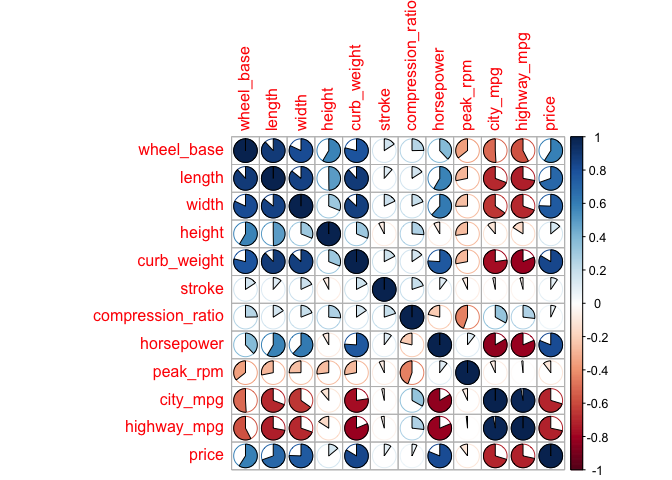

``` r
corrplot.mixed(x, tl.col = "black", lower = "number", upper = "shade", lower.col = "blue", number.cex = .7)
```

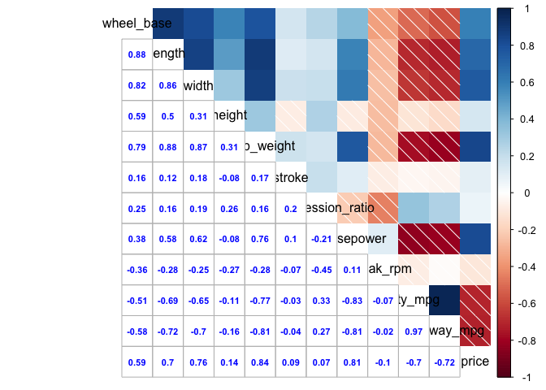

8) Principal Components Analysis
================================

``` r
pca_dat_85 <- prcomp(
  qdat,
  scale. = TRUE
)
 pca_dat_85
```

    ## Standard deviations (1, .., p=12):
    ##  [1] 2.5144853 1.5010068 1.0698886 0.8724719 0.7607877 0.5582168 0.4933172
    ##  [8] 0.3479834 0.3342119 0.2769701 0.2343530 0.1424209
    ## 
    ## Rotation (n x k) = (12 x 12):
    ##                           PC1         PC2         PC3         PC4
    ## wheel_base         0.32692396 -0.27054417  0.11934767 -0.21002511
    ## length             0.36569353 -0.14418914  0.10514838 -0.10740171
    ## width              0.35909675 -0.10806971 -0.06852236  0.02009788
    ## height             0.13943399 -0.38064026  0.49944275 -0.46380229
    ## curb_weight        0.38390270 -0.04895805 -0.07115161  0.09662591
    ## stroke             0.05934729 -0.10908648 -0.76767892 -0.55895253
    ## compression_ratio  0.01933814 -0.53003290 -0.26858766  0.24293756
    ## horsepower         0.31519058  0.31167436 -0.16080791  0.18135190
    ## peak_rpm          -0.08273330  0.45801902  0.04487719 -0.50096559
    ## city_mpg          -0.33811751 -0.28968705 -0.07250886  0.03988481
    ## highway_mpg       -0.34989782 -0.23953055 -0.07755676  0.03692682
    ## price              0.34172720  0.07747165 -0.12199605  0.24747780
    ##                            PC5         PC6         PC7         PC8
    ## wheel_base         0.032048555 -0.41461753  0.11580351  0.19917220
    ## length             0.001949777 -0.21105999 -0.09400544  0.52758276
    ## width             -0.100359781 -0.49545668  0.08522643 -0.53445951
    ## height            -0.060528663  0.52487361  0.15299332 -0.13506201
    ## curb_weight       -0.021567243  0.05708229 -0.06661099  0.17228352
    ## stroke             0.228901818  0.14637016  0.06858809 -0.03397987
    ## compression_ratio -0.539137256  0.17671078 -0.48472751 -0.03481953
    ## horsepower        -0.115163169  0.29687663  0.12115904  0.41930975
    ## peak_rpm          -0.695703743 -0.15702100 -0.08953831  0.02948443
    ## city_mpg          -0.173503922 -0.16510726  0.38329540  0.17206521
    ## highway_mpg       -0.167962880 -0.12595986  0.41618431  0.28688959
    ## price             -0.293465024  0.22527631  0.60013211 -0.23968196
    ##                            PC9         PC10         PC11         PC12
    ## wheel_base        -0.483145253 -0.474046740 -0.259909949  0.099269909
    ## length             0.127855466  0.663256489 -0.069174198 -0.173535166
    ## width              0.550629507 -0.032094509 -0.034585505  0.019804817
    ## height             0.216482561 -0.058655785  0.001008972  0.002140646
    ## curb_weight       -0.009971605 -0.193628795  0.859534236  0.146935002
    ## stroke            -0.002486957  0.052887480 -0.010871384 -0.014781677
    ## compression_ratio -0.068796311 -0.024717249 -0.154010413  0.020031187
    ## horsepower         0.421234863 -0.403808719 -0.329954766 -0.059138753
    ## peak_rpm          -0.052139651 -0.004616197  0.100248425  0.007613464
    ## city_mpg           0.108355869 -0.173222560  0.206131303 -0.690497398
    ## highway_mpg        0.222091393  0.086042334  0.017461844  0.675420447
    ## price             -0.392561596  0.299178362 -0.045969026 -0.029829228

``` r
 names(pca_dat_85)
```

    ## [1] "sdev"     "rotation" "center"   "scale"    "x"

``` r
 eigenvalues <- pca_dat_85$sdev^2
eigenvalues
```

    ##  [1] 6.32263627 2.25302150 1.14466161 0.76120727 0.57879798 0.31160595
    ##  [7] 0.24336186 0.12109247 0.11169761 0.07671245 0.05492133 0.02028371

``` r
#After examining the eigenvalues the proportion of variation that is "captured" by the first three components are 6.32, 2.25, and 1.14. 
barplot(eigenvalues)
```

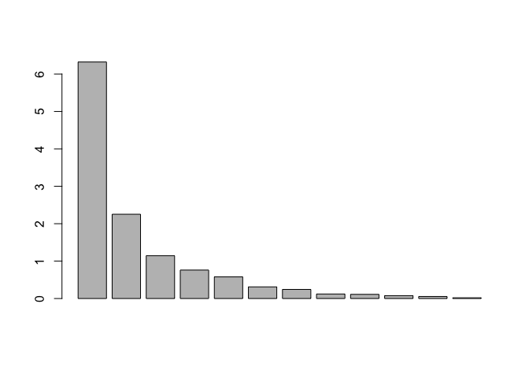

``` r
summary(eigenvalues)
```

    ##    Min. 1st Qu.  Median    Mean 3rd Qu.    Max. 
    ## 0.02028 0.10295 0.27748 1.00000 0.85707 6.32264

``` r
eigenvalues1 <- pca_dat_85$rotation
plot(eigenvalues1[,1], eigenvalues1[,2])
```

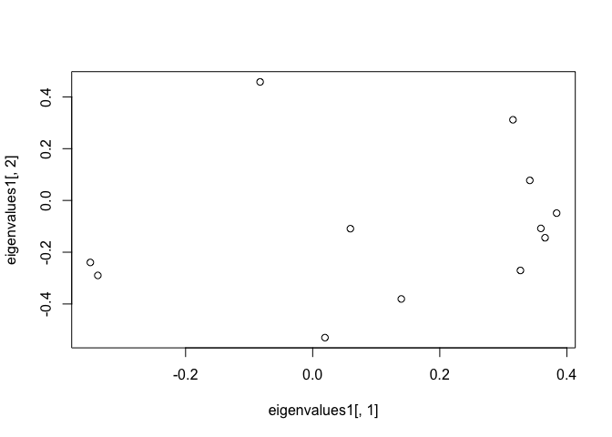

``` r
plot(eigenvalues[1:2])
```

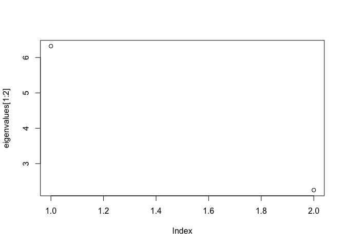

``` r
percentage <- eigenvalues1/sum(eigenvalues1)
percentage
```

    ##                           PC1         PC2         PC3         PC4
    ## wheel_base        -0.36273262  0.30017743 -0.13242007  0.23302960
    ## length            -0.40574870  0.15998248 -0.11666550  0.11916564
    ## width             -0.39842937  0.11990681  0.07602776 -0.02229925
    ## height            -0.15470649  0.42233258 -0.55414776  0.51460352
    ## curb_weight       -0.42595236  0.05432053  0.07894499 -0.10720954
    ## stroke            -0.06584772  0.12103495  0.85176440  0.62017577
    ## compression_ratio -0.02145629  0.58808851  0.29800663 -0.26954702
    ## horsepower        -0.34971406 -0.34581270  0.17842153 -0.20121575
    ## peak_rpm           0.09179525 -0.50818680 -0.04979269  0.55583739
    ## city_mpg           0.37515222  0.32141708  0.08045091 -0.04425347
    ## highway_mpg        0.38822286  0.26576683  0.08605171 -0.04097149
    ## price             -0.37915729 -0.08595728  0.13535853 -0.27458456
    ##                           PC5         PC6         PC7         PC8
    ## wheel_base        -0.03555890  0.46003145 -0.12848771 -0.22098795
    ## length            -0.00216334  0.23417783  0.10430206 -0.58537000
    ## width              0.11135240  0.54972509 -0.09456146  0.59299998
    ## height             0.06715849 -0.58236412 -0.16975100  0.14985563
    ## curb_weight        0.02392955 -0.06333463  0.07390703 -0.19115409
    ## stroke            -0.25397391 -0.16240239 -0.07610069  0.03770175
    ## compression_ratio  0.59819009 -0.19606628  0.53782073  0.03863338
    ## horsepower         0.12777723 -0.32939415 -0.13442984 -0.46523762
    ## peak_rpm           0.77190563  0.17421984  0.09934563 -0.03271392
    ## city_mpg           0.19250817  0.18319180 -0.42527854 -0.19091187
    ## highway_mpg        0.18636020  0.13975651 -0.46176984 -0.31831320
    ## price              0.32560886 -0.24995130 -0.66586584  0.26593483
    ##                            PC9         PC10         PC11         PC12
    ## wheel_base         0.536065160  0.525970069  0.288378428 -0.110143149
    ## length            -0.141859742 -0.735904356  0.076750992  0.192542835
    ## width             -0.610941106  0.035609887  0.038373728 -0.021974080
    ## height            -0.240194348  0.065080476 -0.001119487 -0.002375116
    ## curb_weight        0.011063816  0.214837361 -0.953680815 -0.163029099
    ## stroke             0.002759358 -0.058680357  0.012062150  0.016400745
    ## compression_ratio  0.076331715  0.027424581  0.170879495 -0.022225244
    ## horsepower        -0.467373597  0.448038731  0.366095401  0.065616344
    ## peak_rpm           0.057850615  0.005121818 -0.111228844 -0.008447382
    ## city_mpg          -0.120224314  0.192195988 -0.228709294  0.766129019
    ## highway_mpg       -0.246417527 -0.095466730 -0.019374476 -0.749400658
    ## price              0.435559687 -0.331947992  0.051004110  0.033096486

``` r
barplot(percentage)
```

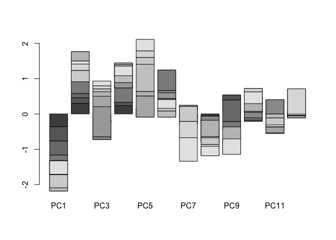

``` r
biplot(percentage, eigenvalues1)
```

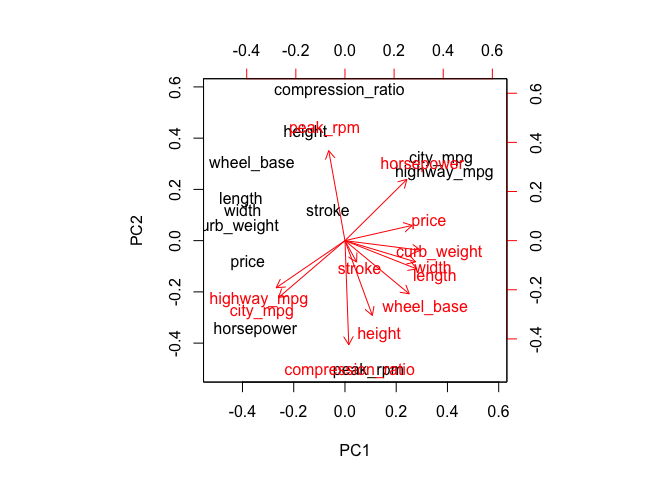

``` r
scores <- pca_dat_85$x
plot(scores[,1],scores[,2])
```

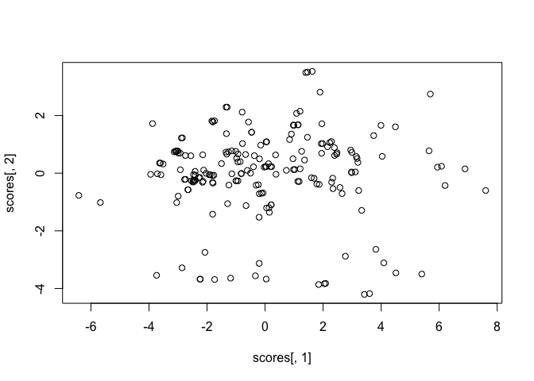

``` r
#These plots demonstrate how the first principal components contain more varaiblilty than the other principal components. In the first barplot there is higher correlation between the first variables with the overall summary than the other values. The eigenvalues show that the first PC (wheel_base) holds a higher variance. 
```
